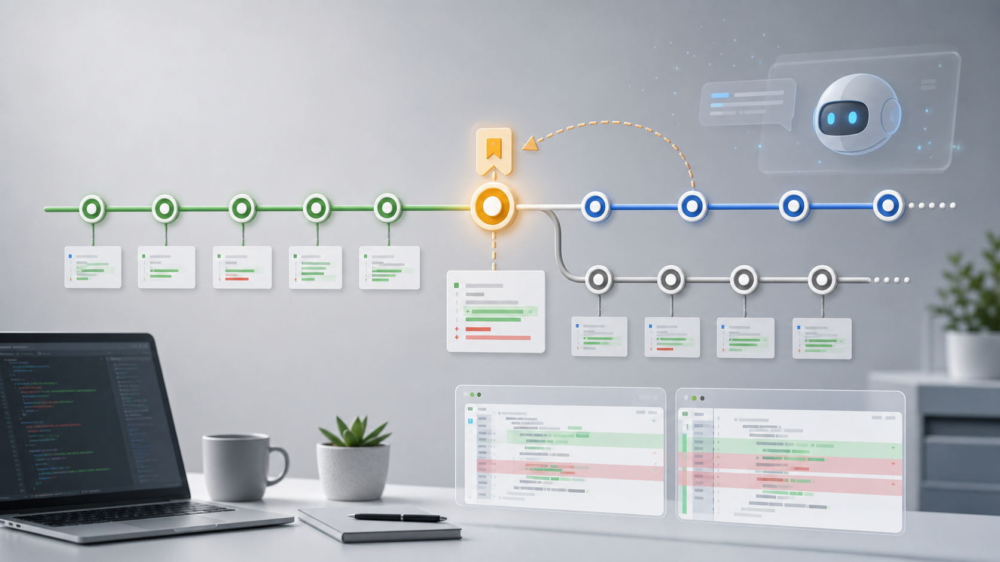

# AI Coding 移动端工程实践（四）：用 AI 写代码，什么时候该 git commit？什么时候该回退？

> AI 写代码很快，所以更需要小步提交、清晰 diff 和可回退的工作流。

---

## 前言

AI 最大的问题之一，是它很容易一次改太多。

页面、接口、路由、样式、测试一起改，看起来效率很高，但 review 和回退会变得非常痛苦。

所以用 AI 写代码，Git 工作流要更严格。

---

## 一、开始前先看状态

让 AI 动手前，先看：

```
git status
```

确认三件事：

- 当前有没有未提交代码
- 哪些改动是你自己的
- 哪些文件不应该被 AI 碰

如果工作区已经很脏，最好先提交、切新分支，或者在确认 `git diff` 之后再 stash。不要把不清楚来源的改动随手 stash 掉，否则后面很容易忘记恢复，或者把两次任务混在一起。

---

## 二、一个任务一个 commit

比较稳的粒度是：

- 新增一个页面
- 修一个 bug
- 补一组测试
- 做一次小重构
- 更新一份文档

不要把「新页面 + 路由 + 网络层 + 样式重构 + 测试」塞进一个 commit。

AI 越能写，commit 越要小。



---

## 三、什么时候该 commit

这些时机适合提交：

- 功能已经跑通
- 测试通过
- diff 范围清楚
- 没有混入无关修改
- 这一步可以独立回退

commit message 可以简单但要明确：

```
feat(order): add refund list page
fix(login): handle token refresh failure
test(order): add order list view model tests
docs(ai): add project map workflow
```

---

## 四、什么时候该回退

这些情况应该考虑回退：

- AI 改了不该改的全局文件
- 为了一个小需求引入一堆抽象
- 路由、状态、网络层被顺手重构
- diff 大到你已经 review 不动
- 编译失败且修复方向越来越乱

回退不是失败，是控制风险。

---

## 五、先区分 restore、revert、reset

不要一说回退就想到 `reset --hard`。

更稳的理解是：

- `git restore`：撤销工作区或暂存区里的文件修改
- `git revert`：用一个新 commit 抵消已经提交的改动，适合已经共享的提交
- `git reset`：移动分支指针，可能改写历史
- `git reset --hard`：同时丢弃工作区修改，风险最高

AI 改坏了文件，很多时候只需要 `git restore <file>`，没必要重置整个仓库。

但前提是：你确认这个文件里的改动都可以丢弃。如果同一个文件里既有 AI 改坏的内容，也有你自己的手写修改，就不要直接 restore 整个文件，应该先看 `git diff`，只手动拿掉有问题的部分。

---

## 六、不要轻易 reset --hard

`git reset --hard` 很危险，尤其是在工作区里还有你自己未提交代码时。

更安全的做法是：

- 先看 `git diff`
- 只回退 AI 改坏的文件
- 或者用新分支隔离 AI 实验
- 真要清理前，确认没有用户自己的改动

不要为了省事，把别人的改动一起清掉。

---

## 七、让 AI 也遵守 Git 规则

可以在任务里明确要求：

```
修改前先列计划。
一次只改和本任务相关的文件。
改完后总结 diff。
不要自动提交。
如果需要回退，先说明要回退哪些文件和原因。
```

AI 可以写代码，但 Git 边界要由人控制。

---

## 参考资料与延伸阅读

- Git Book：[Undoing Things](https://git-scm.com/book/en/v2/Git-Basics-Undoing-Things)
- GitLab Docs：[Revert and undo changes](https://docs.gitlab.com/topics/git/undo/)

---

## 写在最后

AI Coding 不是让 Git 变得不重要，而是让 Git 更重要。

小步提交、清晰 diff、可回退，是 AI 时代移动端开发者必须守住的基本功。

---

*本文首发于微信公众号「iOS观之」（微信号：run88184），欢迎关注。*
