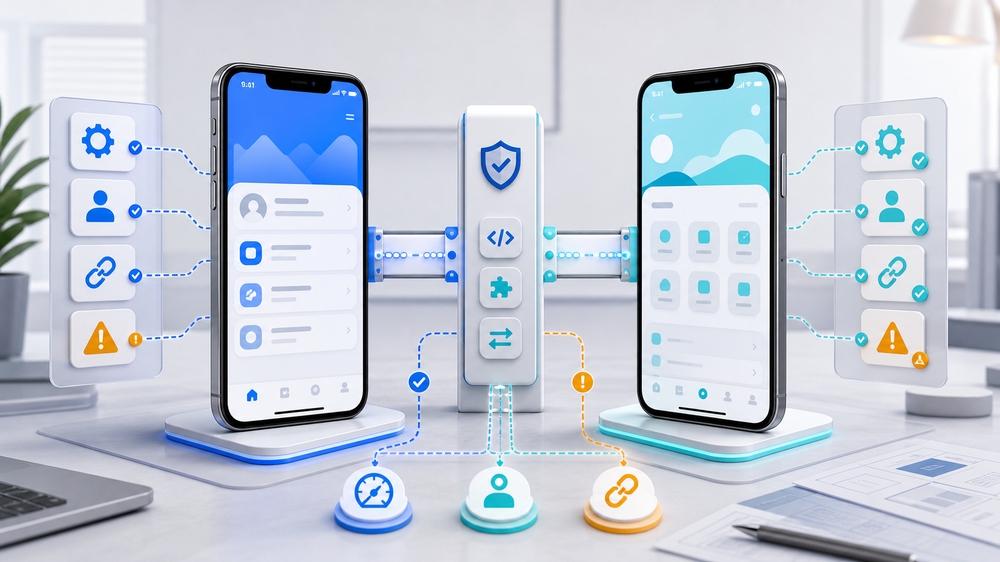

# AI Coding 移动端工程实践（六）：iOS / Flutter 混合项目里，AI 最容易踩哪些坑？

> 混合项目的难点不在 Swift 或 Dart 单独怎么写，而在原生和 Flutter 的边界怎么守。

---

## 前言

iOS / Flutter 混合项目里，AI 很容易写出「局部能跑、整体变乱」的代码。

因为它看到一个需求时，可能不知道这段逻辑应该放在原生侧、Flutter 侧，还是桥接层。

---

## 一、MethodChannel 变成业务垃圾桶

最常见的问题是：什么都往 MethodChannel 里塞。

正确边界应该是：

- Dart 侧定义平台接口
- iOS 侧处理平台能力
- 桥接层只传递类型清晰的数据
- 业务判断回到业务层

MethodChannel 不应该处理 UI 展示，也不应该承载复杂业务流程。

如果桥接接口越来越多，优先考虑 Pigeon。Flutter 官方文档也明确提到，普通 `MethodChannel` 不是类型安全的，调用双方必须自己保证参数和类型一致；Pigeon 可以生成类型安全的跨端接口，减少字符串和 Map 手写错误。

---

## 二、Flutter engine 初始化被忽略

Deep Link、推送点击、冷启动跳转，都可能遇到 Flutter engine 尚未初始化的问题。

AI 很容易只写「从 App 内点击跳转」的路径，却漏掉：

- 冷启动
- 登录态恢复中
- Flutter engine 未 ready
- 路由参数需要缓存
- 目标页面不存在

这些路径必须单独验证。

---

## 三、原生登录态和 Flutter 登录态不同步

登录态是混合项目里的高风险点。

不要让 AI 随便在 Flutter 侧维护一套独立登录态，也不要让原生侧直接拼业务参数传给 Flutter。

更稳的做法是：

- 登录态有统一来源
- Token 刷新有统一入口
- Flutter 只通过约定接口获取状态
- 失败态有明确兜底

---

## 四、Pod 和 Runner 配置被乱改

Flutter iOS 项目里，AI 有时会顺手改：

- Podfile
- Runner 配置
- Generated.xcconfig
- Build Settings
- Signing 配置

这些文件不能随便动。

如果必须改，先让 AI 说明原因、影响范围和回退方式。

---

## 五、体验割裂

Flutter 页面和原生页面切换时，用户感知很明显：

- 动画不一致
- 返回手势不一致
- 键盘处理不一致
- loading 和 toast 风格不一致
- Haptic 时机不一致

AI 可以生成页面，但体验必须真机检查。

---

## 六、至少准备一张验证矩阵

混合项目的问题经常不出现在单一路径，而是出现在状态组合里。让 AI 改完以后，至少要按下面这些维度验证：

- 启动状态：冷启动、热启动、后台恢复
- 登录状态：未登录、已登录、Token 过期、刷新失败
- Engine 状态：未初始化、初始化中、已 ready
- 入口来源：原生点击、Deep Link、推送点击、Flutter 内跳转
- 网络环境：正常网络、弱网、接口失败
- 返回路径：系统返回、左滑返回、原生返回按钮、Flutter 内部返回

这些路径不一定每次都全量回归，但高风险需求必须抽样覆盖。尤其是 Deep Link、登录态和 engine ready 这三类组合，最容易在真机上暴露问题。

---

## 参考资料与延伸阅读

- Flutter Docs：[Platform channels](https://docs.flutter.dev/platform-integration/platform-channels)
- Pub.dev：[Pigeon](https://pub.dev/packages/pigeon)

---

## 写在最后

iOS / Flutter 混合项目里，用 AI 的关键不是让它多写代码，而是让它守住边界。

边界清楚，AI 是加速器；边界模糊，AI 会把复杂度放大。

---

*本文首发于微信公众号「iOS观之」（微信号：run88184），欢迎关注。*
