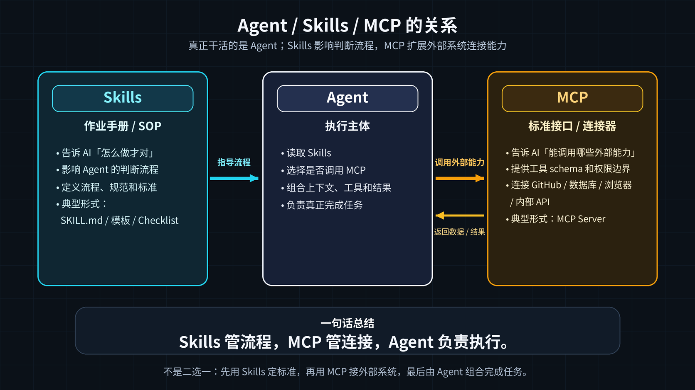

# Agent Skills 和 MCP 到底有什么区别？聊聊 AI 编程里的两种扩展方式

> 我更愿意把 Skills 看成作业手册，把 MCP 看成标准接口。前者影响 AI 怎么判断、按什么流程做事；后者告诉 AI 可以连到哪些外部系统。

---

## 前言

最近看 AI 编程工具，Skills 和 MCP 这两个词出现得越来越多。

GitHub 上相关示例和 MCP Server 都在变多。问题也跟着来了：这两个东西到底分别解决什么问题？我应该写一个 Skill，还是配一个 MCP Server？为什么有人折腾了很久的 MCP Server，最后发现一个简单的 `SKILL.md` 就够了？

这篇先不追热点名词，只把边界说清楚。

---

## 一、先看一个场景

假设你要让 AI 帮你做 Code Review。

**用 Skills 怎么做？**

写一个 `SKILL.md`，告诉 AI：

```markdown
# Code Review Skill
1. 先检查命名规范
2. 再检查错误处理
3. 最后检查性能问题
4. 输出按严重程度分级：Critical / Major / Minor
```

AI 读到这份"标准作业程序"，就知道应该按什么顺序看代码。

**用 MCP 怎么做？**

写一个 MCP Server，暴露工具给 AI 调用：

```
工具1: get_pr_diff(pr_id) → 拉取 PR 变更
工具2: post_review_comment(pr_id, file, line, comment) → 发表评论
工具3: get_file_blame(file, line) → 查谁写的这行
```

至于什么时候调用哪个工具、怎么组合结果，仍然由 Agent 自己判断。

这里的差别已经很明显了：Skills 定义流程，MCP 提供能力入口。

---

## 二、本质区别：软编排 vs 硬编排

我会先从这几项拆开看。

| 维度 | Skills | MCP |
|---|---|---|
| **本质** | 声明式知识包（Markdown + 可选脚本/资源） | 模型上下文与工具连接协议（JSON-RPC） |
| **编排方式** | **软编排**：流程写在指令里，AI 可见上下文和推理目标 | **硬边界**：能力封装在工具里，AI 通过 schema 调用 |
| **运行时** | 按需加载进会话上下文，可配合宿主环境脚本执行 | 独立进程，跨进程通信 |
| **决策者** | AI 模型在运行时动态判断 | 开发者定义工具边界，AI 运行时选择是否调用 |
| **Token 成本** | 常驻少量元数据，触发后渐进加载完整指令和资源 | 工具 schema 会进入上下文，开销取决于服务器数量和工具复杂度 |
| **开发门槛** | 会写 Markdown 就行 | 需要编程，处理认证、限流、错误 |
| **确定性** | 流程灵活，依赖模型遵循程度 | 工具执行更确定，但整体效果仍取决于调用选择 |

严格说，MCP 不只提供 Tools，也可以暴露 Resources、Prompts 等能力。为了方便理解，本文重点讨论最常见的 **MCP Tools** 场景。

我的理解是：

> Skills 把流程和判断标准交给 AI；MCP 把外部能力包装成清晰的接口。

---

## 三、类比：作业手册 vs 标准接口

我现在更倾向于用这个类比：

```
Skills  = 作业手册 / SOP    → 告诉 AI「怎么做才对」
MCP     = 标准接口 / 连接器 → 告诉 AI「能调用哪些外部能力」
```

- 你给 AI 一本《代码审查 Checklist》→ 这是 **Skill**
- 你给 AI 接上 GitHub API，让它能真正去 PR 下面评论 → 这是 **MCP**

真正干活的是 Agent；Skills 影响它的判断流程，MCP 扩展它能触达的外部系统。两者不是互相替代。

---

## 四、性能实测：MCP 不一定更快

Arize 做过一个 GitHub 任务场景下的 500 次试验。结果挺有意思：

| 指标 | MCP | Skill（短） | Skill（长） | 裸 Claude |
|---|---|---|---|---|
| **正确率** | 83.4% | 83.3% | 82.6% | 84.5% |
| **成本（最难任务）** | **6 倍** | 基准线 | 略高 | 略高 |
| **延迟（最难任务）** | **5 倍** | 基准线 | 更长 | 更长 |
| **工具忠实度** | 33%（经常逃逸到 bash） | >99% | >99% | N/A |

我比较在意的是这点：

在 GitHub 这种已经有成熟 CLI、任务又需要大量组合查询的场景里，Skills 反而可能更快、更省钱。原因也不复杂：Skill 可以指导 AI 直接用 `gh` 命令，再配合 `grep` / `jq` 查数据。命令行本来就很适合临时组合；MCP 暴露出来的工具接口，不一定刚好覆盖这些需求。

这不代表 MCP 一定慢。比如创建分支、打开 PR 这类能直接映射到工具端点的任务，MCP 反而更顺手。MCP 真正有价值的地方，还包括认证、权限边界和面向普通用户的易用性。用户不需要理解 CLI 细节，也能把能力接进来。

> 已有成熟 CLI、任务又需要自由组合时，Skills 通常更轻；需要稳定工具边界、复杂认证或对外分发时，MCP 更合适。

---

## 五、什么时候用 Skills？什么时候用 MCP？

### 选 Skills 的场景

- 定义编码规范、Code Review 流程
- 封装团队最佳实践（部署检查清单、API 设计规范）
- 文档生成、PPT 制作等模板驱动型任务
- 多步骤工作流编排（先分析 → 再设计 → 最后实现）
- 团队没有后端资源，需要快速验证想法
- 适合用来教 AI：这类任务应该按什么标准处理

### 选 MCP 的场景

- 对接 GitHub / GitLab（PR、Issue、CI）
- 连接数据库（只读查询、数据分析）
- 浏览器自动化（Playwright、Puppeteer）
- 调用内部 API（部署系统、监控平台）
- 需要企业级权限控制和安全审计
- 适合用来接外部系统：AI 可以调用哪些能力，边界在哪里

### 两者组合（推荐）

实际项目里，经常会把它们组合起来：

```
Layer 3: Skills     → 定义流程和知识（/review、/deploy-check）
Layer 2: Sub-Agent  → 专项隔离执行（code-reviewer、debugger）
Layer 1: MCP        → 提供外部连接（GitHub、数据库、部署管线）
```

Skills 负责写清楚标准，MCP 负责接外部系统。Agent 在中间读规则、调工具、整理结果。

---

## 六、一个反例：别把 Skill 写成 MCP，也别把 MCP 写成 Skill

我见过最容易走偏的，是下面两种情况：

**错误 1：为静态内容写 MCP Server**

有人花了很久写 MCP Server，只为了把公司编码规范传给 AI。后来一看，这类静态内容写成 `SKILL.md` 就够了。

> MCP 是为**有状态的、需要外部交互**的场景设计的。静态知识直接用 Skills。

**错误 2：在 Skill 里写「查询数据库」**

Skill 可以带脚本和资源，但它不会自动拿到数据库或 API 权限。如果你在 `SKILL.md` 里写「先查数据库拿到用户列表」，但宿主环境没有对应工具、凭证或连接能力，AI 还是做不到。

> 涉及外部系统、实时数据、API 调用 → 需要明确的工具连接层。这个连接层可以是 MCP，也可以是宿主环境已经提供的 CLI / SDK / 内部工具。

---

## 七、一张图总结



- Skills 管流程：用 `SKILL.md` / 模板 / Checklist 定义标准
- MCP 管连接：用标准接口连接 GitHub / 数据库 / 内部 API
- Agent 负责执行：读取 Skills，按需调用 MCP，组合完成任务

---

## 小结

Skills 和 MCP 不是二选一。它们解决的是两类问题：

- Skills 解决「流程和标准」问题：让 AI 知道你希望它怎么做
- MCP 解决「外部连接」问题：让 AI 能安全地调用外部系统

实际用起来，我会先问两个问题：这个任务缺的是规则，还是缺外部能力？缺规则，先写 Skill；缺外部能力，再考虑 MCP。

所以问题不是「Skills 和 MCP 哪个更好」。更准确的问题是：你现在缺的是流程规范，还是外部连接能力。
