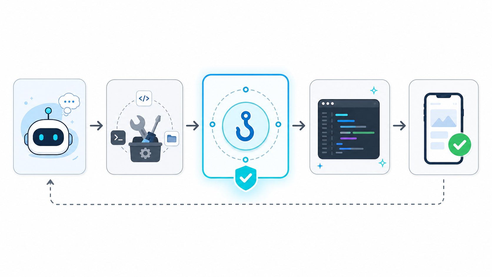
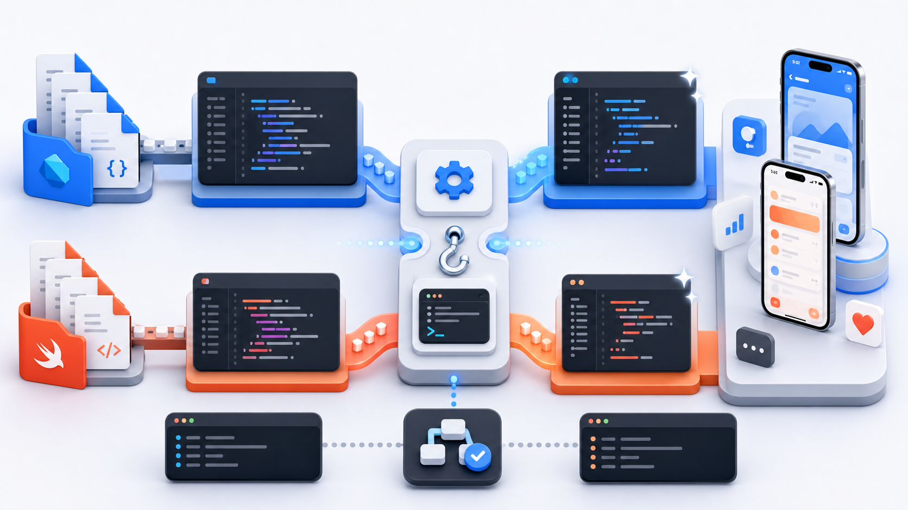

# AI Coding 移动端工程实践（八）：用 Hooks 让 AI 改完代码自动收尾

> 规则写在文档里，是提醒；配成 Hook，才是自动执行。对 iOS / Flutter 项目来说，第一个值得配置的 Hook，就是改完代码自动 format。

---

## 前言

用 AI 写代码久了，会发现一个很现实的问题：

AI 不一定是不会写，而是经常忘了收尾。

比如：

- 改完 Dart 文件，没有执行 `dart format`
- 改完 Swift 文件，留下了一些和项目风格不一致的缩进
- 改完代码就说完成，但没有说明验证过什么
- 动了 `Podfile`、`pubspec.yaml`、`Info.plist` 这类配置文件，却没有提醒你重点 review

这些事情单独看都不大，但在真实项目里很烦。

尤其是移动端项目。一个需求可能同时改 Flutter 页面、Swift 原生桥接、路由、权限、构建配置。AI 改代码的速度很快，如果每次 diff 里混着格式化问题、无关空格、缩进变化，后面 review 会非常难受。

所以这篇不再只讲 Prompt，也不只讲 `AGENTS.md`。

我们来做一件更具体的事：用 Claude Code Hooks 配一个最小自动化，让 AI 每次改完代码后，自动处理 Dart / Swift 的格式化。

---

## 一、Hooks 到底解决什么问题

Stormzhang 在《钩子（Hooks）：在固定时机自动扣扳机》里用了一个很直观的说法：Hooks 就是在固定时机触发动作。

这个理解很适合入门。

在 Claude Code 里，AI 会不断执行工具，比如读文件、改文件、运行命令。Hooks 做的事情，就是在这些固定节点前后插入你自己的命令。

可以简单理解成：

```
AI 准备执行工具前    -> 先检查能不能做
AI 修改文件后        -> 自动 format / 记录日志 / 做轻量检查
AI 任务结束时        -> 提醒验证结果
AI 开始会话时        -> 注入项目上下文
```

这和 Prompt、规则文件、Skills、MCP 都不一样。

| 方式 | 主要作用 | 稳定性 |
|---|---|---|
| Prompt | 告诉 AI 当前任务怎么做 | 容易漏 |
| `AGENTS.md` / `CLAUDE.md` | 告诉 AI 项目规则是什么 | 依赖 AI 遵守 |
| Skills | 告诉 AI 一类任务按什么流程做 | 依赖 AI 触发和执行 |
| MCP | 告诉 AI 可以连接哪些外部系统 | 适合工具能力扩展 |
| Hooks | 到了固定时机自动执行动作 | 更确定 |

我的理解是：

> Prompt 和规则文件解决的是“告诉 AI”；Hooks 解决的是“到了这个点就直接做”。



这就是 Hooks 的价值。它不需要 AI 每次都记得，也不需要你每次都提醒。

---

## 二、移动端项目为什么适合先配 format Hook

移动端项目有很多更复杂的自动化，比如构建、测试、打包、发布。

但我不建议一开始就把 Hooks 配得很重。

第一个 Hook，最好选一个简单、稳定、低风险、收益明显的场景。

比如：改完代码自动 format。

原因很简单：

- format 不改变业务逻辑
- format 能减少无意义 diff
- format 失败时容易发现
- format 的收益每天都能看到
- format 适合作为 Hook 入门样例

对 Flutter 项目来说，`dart format` 是 Dart SDK 自带能力，不需要额外引入工具。

对 Swift 项目来说，情况稍微复杂一点。有的团队用 SwiftFormat，有的团队用 Apple 的 swift-format，也有的团队只在 CI 里做检查。因此 Swift 不适合在文章里直接假设某个工具，而更适合走项目自己的脚本。

也就是说：

| 文件类型 | 推荐处理方式 | 说明 |
|---|---|---|
| `.dart` | 直接执行 `dart format` | Dart SDK 自带，适合自动执行 |
| `.swift` | 调用项目内 `scripts/format-swift.sh` | 不假设具体工具，尊重团队已有规范 |
| `Podfile` | 不自动处理，只提醒 review | 构建配置改动要谨慎 |
| `pubspec.yaml` | 不自动改结构，只提醒检查依赖 | 涉及依赖和资源声明 |
| `Info.plist` | 不自动处理，只提醒人工确认 | 涉及权限、配置、审核风险 |

这里的边界很重要。

自动 format 适合放进 Hook。自动修复杂 lint、自动改依赖、自动调整配置文件，就要谨慎得多。

---

## 三、先准备一个 Hook 脚本

下面以一个 iOS + Flutter 混合项目为例。

目标是：

- AI 修改 `.dart` 文件后，自动执行 `dart format`
- AI 修改 `.swift` 文件后，如果项目存在 `scripts/format-swift.sh`，就调用它
- 其他文件不处理

先在项目根目录创建目录：

```
mkdir -p .claude/hooks
```

然后新建文件：

```
.claude/hooks/format-after-edit.sh
```

内容如下：

```
#!/bin/bash
set -euo pipefail

# Claude Code 会通过 stdin 传入本次工具调用信息。
INPUT="$(cat)"

# Hook 可能从不同目录执行，优先使用 Claude Code 提供的项目根目录。
PROJECT_DIR="${CLAUDE_PROJECT_DIR:-$(pwd)}"

# 当前示例依赖 jq 解析 JSON。
# 如果团队不想依赖 jq，可以改成 Python / Ruby 等项目内已有脚本。
FILE_PATH="$(printf '%s' "$INPUT" | jq -r '.tool_input.file_path // empty')"

if [ -z "$FILE_PATH" ]; then
  exit 0
fi

case "$FILE_PATH" in
  /*)
    TARGET_FILE="$FILE_PATH"
    ;;
  *)
    TARGET_FILE="$PROJECT_DIR/$FILE_PATH"
    ;;
esac

if [ ! -f "$TARGET_FILE" ]; then
  exit 0
fi

case "$TARGET_FILE" in
  *.dart)
    dart format "$TARGET_FILE" >/dev/null
    ;;
  *.swift)
    if [ -x "$PROJECT_DIR/scripts/format-swift.sh" ]; then
      "$PROJECT_DIR/scripts/format-swift.sh" "$TARGET_FILE"
    fi
    ;;
  *)
    exit 0
    ;;
esac
```

这段脚本做了几件事：

1. 从 stdin 读取 Claude Code 传进来的工具调用信息
2. 从 JSON 里取出被修改的文件路径
3. 判断文件是否存在
4. 如果是 `.dart`，执行 `dart format`
5. 如果是 `.swift`，调用项目自己的 Swift 格式化脚本
6. 其他文件直接跳过

这里没有直接写 SwiftFormat 或 swift-format 的命令，是有意的。

因为 Swift 格式化工具在不同团队里差异比较大。Hook 最好只负责调度，不要偷偷替项目决定格式化工具。

如果你的项目已经有 Swift 格式化脚本，可以让它放在：

```
scripts/format-swift.sh
```

Hook 只调用它。

如果项目暂时没有 Swift 格式化脚本，也没关系。`.swift` 文件会被跳过，不会阻塞 AI 继续工作。

---

## 四、给脚本执行权限

脚本写完以后，需要加执行权限：

```
chmod +x .claude/hooks/format-after-edit.sh
```

如果你的项目有 Swift 格式化脚本，也要确保它能执行：

```
chmod +x scripts/format-swift.sh
```

这里顺便说一句：不要为了这篇文章的例子，强行给项目引入新的 Swift 格式化依赖。

更推荐的顺序是：

1. 项目已有 Swift 格式化工具，就在 `scripts/format-swift.sh` 里封装它
2. 项目没有，就先只启用 Dart format
3. 等团队确认 Swift 格式化方案后，再打开 Swift 处理

Hooks 是工程自动化的一部分，不应该变成新的历史包袱。

---

## 五、在 Claude Code 里注册 Hook

接下来修改 Claude Code 的项目配置。

在项目根目录创建或编辑：

```
.claude/settings.json
```

加入：

```
{
  "hooks": {
    "PostToolUse": [
      {
        "matcher": "Edit|Write",
        "hooks": [
          {
            "type": "command",
            "command": "\"$CLAUDE_PROJECT_DIR\"/.claude/hooks/format-after-edit.sh"
          }
        ]
      }
    ]
  }
}
```

这段配置里有三个重点：

| 配置 | 含义 |
|---|---|
| `PostToolUse` | 工具执行完成后触发 |
| `matcher: "Edit|Write"` | 只在 Claude Code 编辑或写入文件后触发 |
| `command` | 真正执行的 Hook 脚本 |

为什么用 `PostToolUse`？

因为 format 应该发生在文件被修改之后。AI 还没写文件之前，format 没有意义。

为什么匹配 `Edit|Write`？

因为这两个工具是最常见的文件修改入口。你也可以按自己的使用情况继续扩展，但刚开始不建议把范围放得太大。

---

## 六、验证 Hook 是否生效

配置完以后，在 Claude Code 里执行：

```
/hooks
```

正常情况下，你应该能看到刚才配置的 `PostToolUse` Hook。

然后可以准备一个临时 Dart 文件，让 AI 做一个很小的修改。

比如告诉它：

```
帮我在这个 Dart 文件里做一个很小的改动，保持原有逻辑不变。
```

AI 修改完成后，看一下 `git diff`。

如果 Hook 生效，你会看到 `.dart` 文件已经被格式化，不需要再手动执行：

```
dart format lib/xxx.dart
```

如果没有生效，优先排查这几件事：

- `.claude/settings.json` 是否是合法 JSON
- `format-after-edit.sh` 是否有执行权限
- 本机是否能执行 `jq`
- 本机是否能执行 `dart format`
- Claude Code 里 `/hooks` 是否能看到这条 Hook

如果你想先看 Hook 收到了什么，也可以临时在脚本里加一行日志：

```
printf '%s\n' "$INPUT" >> "$PROJECT_DIR/.claude/hooks/format-after-edit.log"
```

验证完记得删除日志，避免把无关信息提交进仓库。



---

## 七、这个 Hook 可以继续怎么扩展

第一个版本只做 format，已经够用了。

后面如果想继续扩展，我会优先考虑这几类。

### 1. 对敏感文件只提醒，不自动改

比如这些文件：

```
Podfile
pubspec.yaml
Info.plist
*.entitlements
*.xcconfig
```

它们不是不能改，而是不适合悄悄自动处理。

更合理的做法是：当 AI 修改这些文件后，Hook 输出提醒，让你在 review 时重点看。

### 2. Stop 时提醒验证结果

另一个很实用的 Hook 是 `Stop`。

它可以在 AI 准备结束回复时触发，用来提醒 AI 不要只说“已完成”，而要说明：

- 跑了什么命令
- 命令结果是什么
- 哪些验证没跑
- 剩余风险是什么

这和我前面写 Superpowers 时提到的完成前验证是一回事。

区别在于：Skill 是流程要求，Hook 是固定时机提醒。

### 3. PreToolUse 拦截危险命令

如果你更关心安全，可以再看 `PreToolUse`。

它适合在工具执行前做检查，比如：

- 是否要删除文件
- 是否要强制回退 Git
- 是否要修改发布证书
- 是否要改签名配置

这些动作一旦发生，影响可能比较大。比起事后发现，不如事前拦一下。

---

## 八、Hooks 和 Skills 应该怎么配合

前一篇我写过 Superpowers 和 Skills。

如果把它们放在一起看，关系其实很清楚：

```
AGENTS.md  -> 项目规则
Skills     -> 任务流程
Hooks      -> 固定节点自动动作
MCP        -> 外部系统连接
```

举几个例子：

| 场景 | Skill 负责 | Hook 负责 |
|---|---|---|
| 修 bug | 要求先找根因、再改代码 | 结束时提醒输出复现、原因、验证 |
| 改 Flutter 页面 | 要求遵守项目组件规范 | 修改 Dart 后自动 format |
| 改 iOS 原生桥接 | 要求确认跨端边界 | 修改 Swift 后调用项目格式化脚本 |
| 改发布配置 | 要求说明影响范围 | 检测到敏感文件后提醒 review |

Skills 更像作业手册。

Hooks 更像自动化卡点。

它们不是互相替代，而是互相补位。

---

## 九、不要把 Hooks 配得太重

Hooks 很有用，但不适合一上来就配一堆。

我见过最容易走偏的是这几类：

- 每次改文件都跑全量测试，导致 AI 每一步都很慢
- Hook 脚本写得太复杂，后面没人敢改
- 自动修复逻辑太激进，改出了新的问题
- 把业务判断藏进 shell 脚本里，团队成员不知道发生了什么
- 从网上复制脚本，不审查就直接执行

我的建议是：

> 高风险动作可以强拦截，低风险动作先自动化，复杂判断尽量不要塞进 Hook。

改完代码自动 format，属于低风险动作。

修改证书、签名、依赖、发布配置，属于高风险动作。

前者可以自动做，后者更适合提醒和人工确认。

---

## 写在最后

AI Coding 的工程化，不是把所有事情都交给 AI。

恰恰相反，它是把一些容易忘、但每次都应该做的动作，从聊天提醒里拿出来，放进项目自动化里。

`AGENTS.md` 解决“规则写在哪里”。

Skills 解决“任务应该按什么流程做”。

Hooks 解决“到了固定时机必须执行什么”。

对 iOS / Flutter 开发者来说，第一个最值得配置的 Hook，就是改完代码自动 format。

它简单、低风险、收益稳定。

先从这里开始，让 AI 不只是会写代码，也能在写完以后顺手把尾收干净。

---

*本文首发于微信公众号「iOS观之」（微信号：run88184），欢迎关注。*
