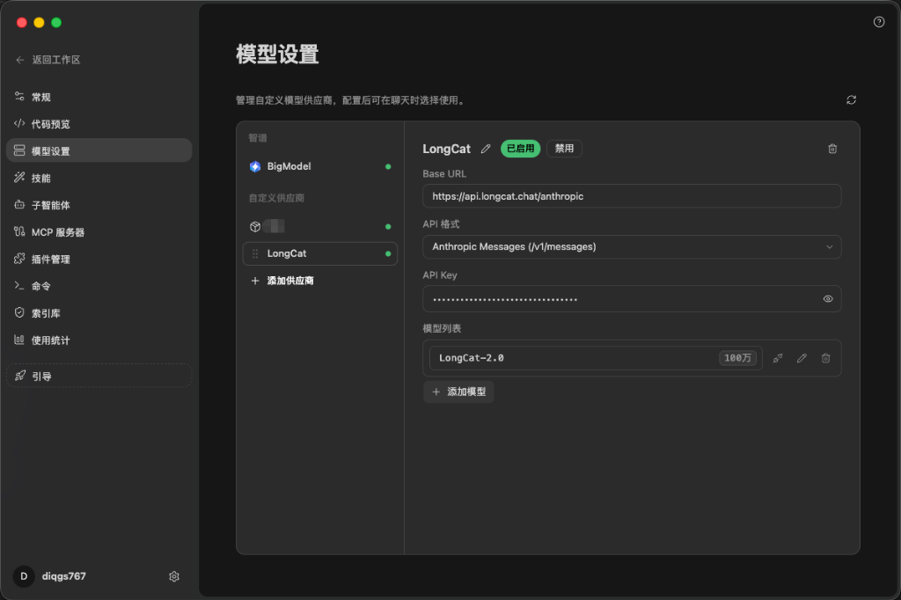
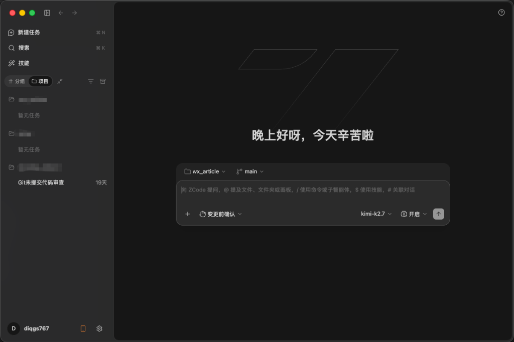
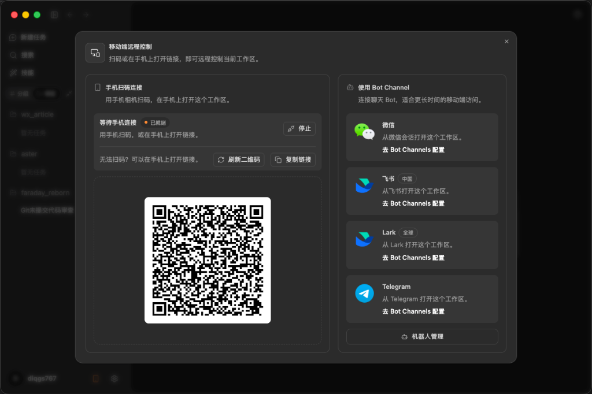
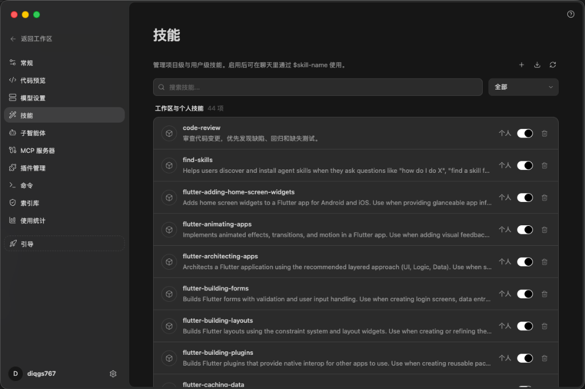

# 被 Claude 封怕了？聊聊智谱的 AI 编辑器 Zcode 以及我为什么看好它

> 面对海外工具封号潮与大厂禁用 Claude 的数据安全隐忧，国内开发者真的没有好用的 AI 编程利器了吗？今天聊聊智谱推出的 AI 编辑器 Zcode，看看它如何打破“千篇一律”的换皮套壳，带来极其硬核的自定义模型与手机远程工作体验。

---

## 前言

最近一年，AI 编程工具可以说是层出不穷。从最初的 Copilot 到火爆全网的 Cursor，再到风头正劲的 Claude Code，各种各样的 AI 编辑器和 Agent 工具简直让人眼花缭乱。

但冷静下来看看，市面上大部分所谓的“国产 AI 编辑器”其实有些千篇一律：换个 VS Code 的皮肤，接入个自家的模型，换汤不换药。

与此同时，开发者们正面临着更现实的困境。

一方面是**“国人极不友好”**的海外工具生态。以目前代码能力最强的 Claude 3.5 Sonnet 为例，国内开发者想要稳定使用它，不仅需要折腾网络环境、搞定复杂的海外支付，还要时刻提心吊胆面临封号。

另一方面，是越来越紧迫的**“数据安全与合规”**红线。前段时间阿里也传出禁用内部使用 Claude 的消息。这并不是个例，代码作为企业的核心资产，敏感数据源源不断地送往海外，其潜在的合规与泄露风险是任何一家大厂都无法承受的。

好消息是，**大模型之间的技术代差正在被迅速抹平**。国内头部大模型在代码生成、指令遵循等任务上的表现已经完全能够挑起大梁。我们缺的不再是模型本身，而是一个真正好用、懂开发者、且足够开放的**工具载体**。

就在这个节点，智谱推出了他们的 AI 编辑器——**Zcode**（当前最新版本 3.2.5，已针对 Apple Silicon 深度优化）。深度体验下来，它在“自定义”与“连接性”上的尝试，确实让人眼前一亮。

---

## 一、 绝对开放的“自定义模型”：拒绝全家桶绑定

在当前的国内大模型环境下，不少厂商做编辑器的思路仍然是“全家桶锁死”：用我的编辑器，你就只能用我的模型。这对于有特定模型偏好，或者有本地私有化部署需求的团队来说非常不友好。

而 Zcode 在这方面表现得非常大度。

在 Zcode 的模型设置中，除了默认的智谱官方 BigModel，还提供了一个非常醒目的**“添加供应商”**功能。

在这里，你可以自由接入自定义供应商。比如截图中展示的，开发者可以自己配置 LongCat 的 Anthropic Messages 兼容格式接口，输入自己的 API Key，就能直接在编辑器里跑起来。

甚至在主界面的提问框里，你可以随时自由切换当前使用的底层模型。比如截图中，聊天框的右下角正挂着 `kimi-k2.7`。

这种不搞垄断、把选择权完全交还给开发者的做法，不仅保证了极高的自由度，更解决了数据安全的痛点。企业完全可以通过这个通道，将 Zcode 连接到自己内部署的私有大模型上，实现代码数据不出内网。

---

## 二、 脑洞大开的“手机远程工作”：用微信/飞书随时写代码

如果说自定义模型解决了数据安全的后顾之忧，那么 Zcode 的“移动端远程控制”就直接把脑洞开到了太空。

你有没有遇到过这种场景：刚下班坐上地铁，或者周末正陪家人在外面，突然老板或客户在群里急召：“有个紧急 Bug 必须要改一下，赶紧看下代码！”

这时你只能手忙脚乱地到处找星巴克或者掏出热点连电脑。

而 Zcode 居然做了一个原生且极其硬核的“手机扫码连接”和“机器人 Channel”功能。

在 Zcode 中，你可以通过“手机扫码”直接在手机浏览器里打开当前工作区，远程控制电脑上的编辑器。

更绝的是，它集成了微信、飞书（Lark）、Telegram 等聊天机器人的 Bot Channels。

这意味着什么？你可以将 Zcode 绑定到你的微信或飞书上。当你在外面需要临时改代码时，根本不需要打开电脑和复杂的远程桌面。你只需要在微信聊天框里给你的 Zcode 机器人发一句：

> “帮我把主页面的登录按钮圆角改成 8px，然后提交一个 Git commit。”

Zcode 机器人就会在后台唤醒你电脑上的工作区，自动定位代码、修改、运行检查、完成 Git 提交，并把执行结果在微信里回传给你。

这才是真正的“随时随地，微信办公”。虽然听上去有点让程序员“无处可逃”，但不得不承认，在应对紧急线上故障时，这绝对是个救命神器。

---

## 三、 极其丰富的“技能（Skills）”生态：把 Agent 变成常态工具

大部分 AI 编辑器的交互非常单一，无非就是 Chat 提问或者 Inline 生成。而 Zcode 引入了一个非常有趣的机制——**“技能（Skills）”**。

在 Zcode 的技能面板中，你可以管理项目级和用户级的技能。在对话时，只需通过 `$` 符号即可一键调用。

从图中可以看到，Zcode 目前已经内置和支持了多达 44 项工作区与个人技能。除了通用的 `code-review`，还有非常多针对具体技术栈的细分技能，比如针对 Flutter 跨平台开发的：
* `flutter-adding-home-screen-widgets`（添加桌面小组件）
* `flutter-animating-apps`（动效实现）
* `flutter-building-layouts`（布局构建）
* `flutter-caching-data`（数据缓存）

这些技能将原本需要写一大段 Prompt 引导的复杂任务，封装成了即开即用的“开箱工具”。不仅如此，你还可以配置自定义的子智能体（Sub-agents）和 MCP 服务器，这让 Zcode 具备了极强的向外扩展能力，可以与你现有的工程工作流无缝融合。

---

## 写在最后

在 Claude 动辄封号、大厂出于数据安全纷纷自建防护网的今天，AI 编程工具的下半场竞争，显然已经不再仅仅是“谁的模型跑分高”，而是**“谁的工具更懂开发者，谁的生态更开放安全”**。

智谱 Zcode 的推出，算是在国内 AI 编程编辑器赛道上砸出了一个不一样的水花。

它不搞“全家桶捆绑”，支持极其友好的**自定义供应商**和**第三方模型自由切换**，给有代码安全和个性化需求的团队留足了空间。而**手机端远程控制**和**聊天机器人 Channel** 的加入，更是把大模型时代的移动端工作流玩出了新高度。

如果你也在寻找一个安全、稳定、开放且不用折腾网络环境的 AI 编程伴侣，不妨试试智谱 Zcode。

---

*本文首发于微信公众号「iOS观之」（微信号：run88184），欢迎关注。*
