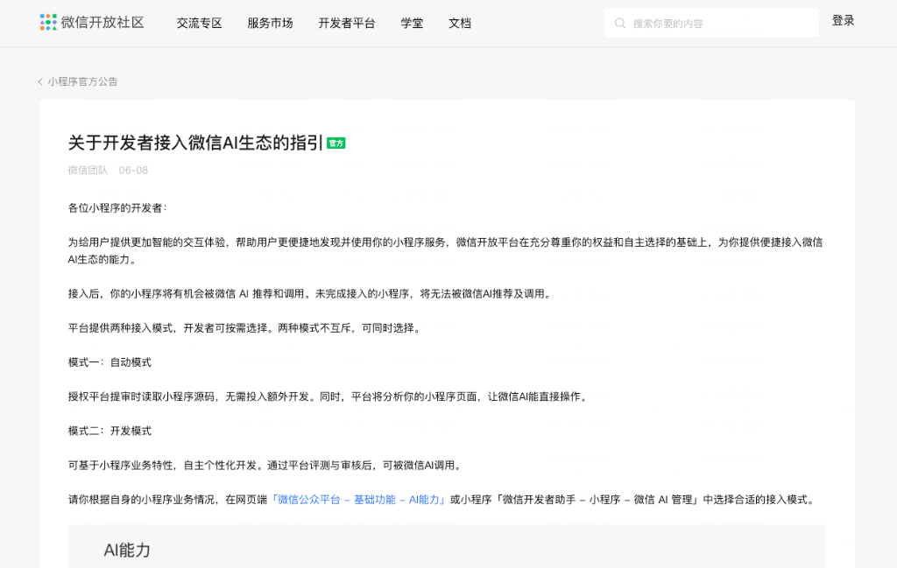
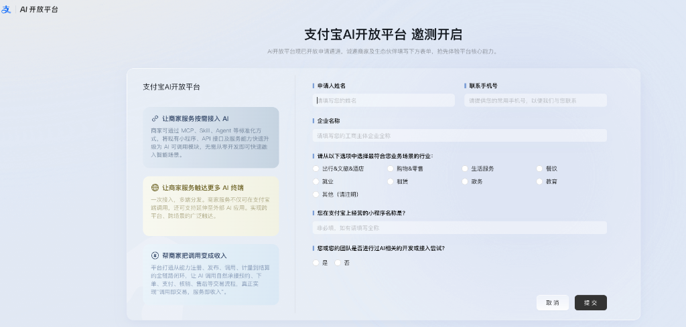

# 微信、支付宝同时“大放水”：我们正站在 AI 应用爆发的前夜

> 当微信允许 AI 自动读取源码操作小程序，当支付宝打通 MCP 协议实现“调用即收入”，AI Agent 的终极分发战役已经打响。

---

## 前言

过去两三年里，科技圈聊得最多的词莫过于“大模型（LLM）”。大家都在卷参数、卷跑分、卷长上下文，生怕在基座模型的军备竞赛中落后一步。

但进入 2026 年，行业的风向标变了。

模型之间的代差正在被迅速抹平，基座模型的红利期基本结束。现在，所有人的目光都聚焦在同一个终极问题上：**大模型如何落地？AI 应用的引爆点到底在哪里？**

就在这两天，国内互联网的两个绝对超级入口——**微信**和**支付宝**，同时向开发者抛出了橄榄枝，开放了各自的 AI 平台接入能力。

这绝不是一次普通的 API 更新。这两大巨头几乎在同一时间“大放水”，标志着 **AI 应用（Agent）的爆发前夜**已经真正到来。

---

## 一、 微信：允许 AI 自动操作小程序

微信团队最新发布了《关于开发者接入微信 AI 生态的指引》。对于数以百万计的小程序开发者来说，这无异于一次降维打击式的流量分发重构。

在这份指引中，微信提供了两种接入模式，其核心亮点在于**“自动模式”**：

*   **自动模式（无感接入）**：开发者授权平台提审时读取小程序源码。微信平台会自动分析小程序的页面结构与功能，**直接让微信 AI 去操作小程序**。这意味着，开发者甚至不需要投入额外的开发成本，你的服务就能直接被微信官方的 AI 助理调用并推荐给用户。
*   **开发模式**：对于业务逻辑较复杂的应用，开发者可以进行自主个性化开发，通过平台评测审核后，接入微信 AI 生态。

### 微信的野心：把聊天框变成超级 Agent 入口

以前，小程序需要用户主动搜索、扫码或者通过好友分享才能触达。

而微信 AI 生态打通后，微信的聊天框和官方 AI 助理将成为最高频的流量分发起点。用户只需要对微信 AI 说一句：“帮我订一张明天下午去上海的高铁票，顺便把酒店也订了。”

微信 AI 就会自动读取相关出行和酒店小程序的源码，理解页面并代用户完成操作。原本孤立的一个个小程序，瞬间变成了微信 AI 助理的“工具箱”（Tools）。

---

## 二、 支付宝：拥抱标准化协议与“调用即收入”

几乎同一时间，支付宝也开启了其 AI 开放平台的邀测。与微信偏向流量分发和“代客操作”的思路不同，支付宝这次展现出了极其强烈的**技术标准化**与**商业闭环**属性。

支付宝 AI 开放平台的核心主张可以概括为三点：

1.  **标准化接入**：支持通过 **MCP（Model Context Protocol，模型上下文协议）**、**Skill**、**Agent** 等前沿的标准化方式，将现有的小程序、API 接口服务能力直接升级为 AI 可调用的模块。
2.  **跨端触达**：商家一次接入，不仅能在支付宝端内被 AI 调度，还可以延伸至外部的第三方 AI 应用，实现跨平台、跨场景的广泛触达。
3.  **商业化闭环（调用即收入）**：这是最吸引开发者的一点。支付宝打通了从能力注册、发布、调用、计量到结算的全链路。当商家的 API 被 AI 调用时，可以真正实现**“调用即交易，服务即收入”**。

### 支付宝的思路：做 AI 时代的服务批发商

如果说微信是在用 AI 重新定义“应用分发”，那么支付宝就是在用 MCP 协议重新定义“服务交易”。

它鼓励开发者把自己的业务能力（如订票、缴费、点外卖）包装成标准的 MCP 接口。在这个模式下，支付宝不只是一个钱包，而是一个连接无数商家 API 与各类 AI 终端的“清算中心”。无论是商家的自建 Agent，还是外部的 AI 硬件，只要调用了这些服务，就能立刻走通支付宝的支付和结算链路。

---

## 三、 微信 VS 支付宝：两条不同的 AI 落地之路

仔细对比两大巨头的动作，我们会发现它们代表了两种截然不同的生态哲学：

| 维度 | 微信 AI 生态 | 支付宝 AI 开放平台 |
| :--- | :--- | :--- |
| **接入门槛** | 极低（自动模式直接读源码解析，无需开发） | 偏技术导向（需适配 MCP、Skill 等标准协议） |
| **核心逻辑** | **AI 操作 UI**（AI 助理直接控制小程序界面） | **AI 调用 API**（将服务转化为标准 API 供 AI 调用） |
| **分发范围** | 微信生态内（聊天框、搜索、小程序生态） | 跨端分发（支付宝端内 + 外部 AI 终端） |
| **商业闭环** | 依赖微信支付与端内转化 | **调用即收入**（打通计量与结算全链路） |

*   **微信的路线**是极致的“体验派”：通过 AI 自动理解源码，让 AI 代替人类去“点”小程序。它保留了小程序的原有界面，重在端内的生态繁荣和流量重新分配。
*   **支付宝的路线**是极致的“务实派”：它拥抱了 MCP 这样的国际标准协议，试图把一切线下和服务能力“API 化”。它不在乎 AI 是怎么调用它的，只要调用发生，就能通过结算链路产生商业价值。

---

## 写在最后：开发者的黄金机会

微信和支付宝的动作，向所有开发者传递出了一个无比明确的信号：

> **别再执着于去卷大模型本身了，赶紧把你的应用和 API 接入 AI 生态。**

以前做小程序、做 App，最大的门槛是推广成本 and 流量获客。而在 AI 生态中，只要你的服务足够好、接口足够标准，巨头的 AI 助理就会主动帮你去触达用户。

这就像是二十年前的互联网大潮，或者十年前移动互联网小程序的兴起。当超级平台把路铺平、把规则放开的时候，第一批入场的开发者往往能分到最大的一块蛋糕。

风口已至，AI 应用的黄金时代，大幕拉开。

---

*本文首发于微信公众号「iOS观之」（微信号：run88184），欢迎关注。*
