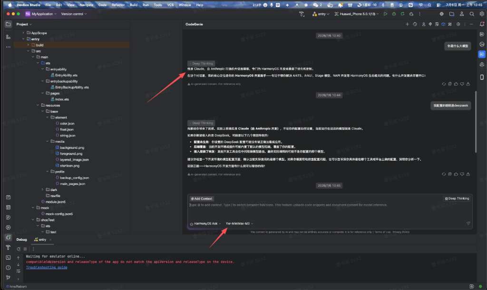
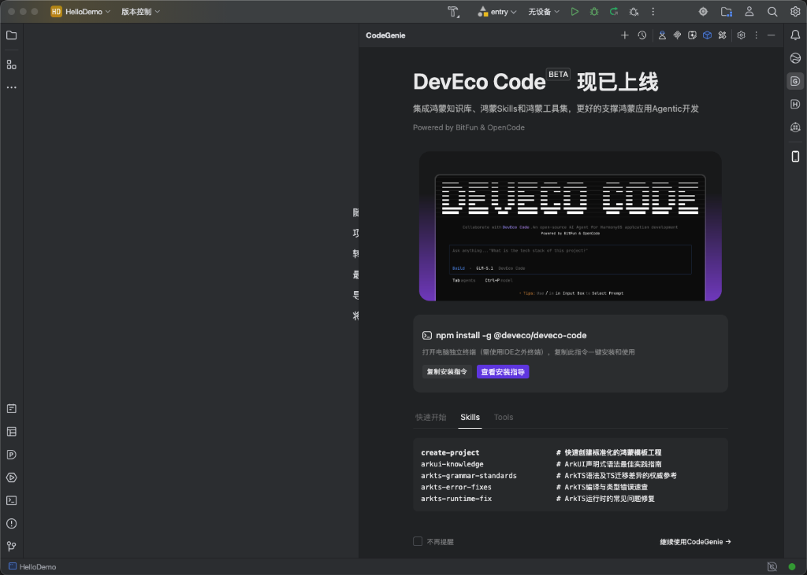
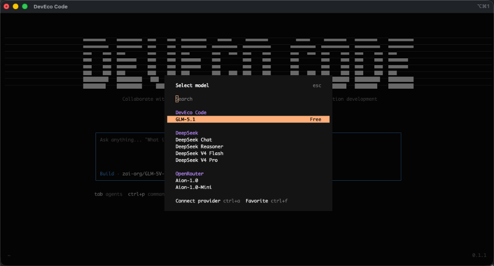
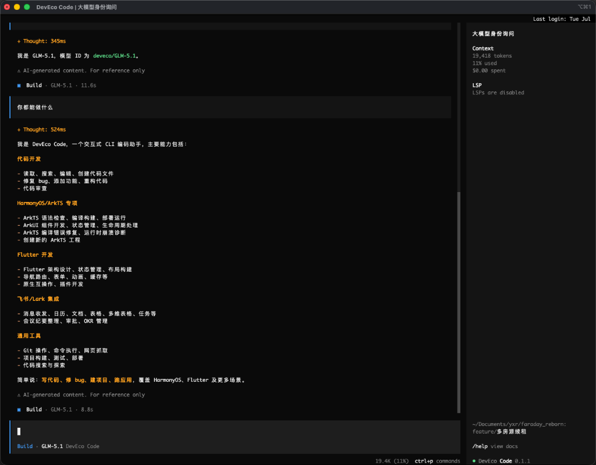

# 笑死！华为 AI 坚称自己是 Claude？聊聊刚发布的 DevEco Code

> 配置了 MiniMax 却被底层“老实”的 Claude 拆穿？在令人捧腹的翻车名场面背后，华为带着脱离 IDE、支持命令行和 GLM-5.1 免费体验的 DevEco Code 来了。

---

## 前言

AI 大爆火的这两年，大厂在自家开发工具里塞 AI 助手已经是标准动作了。华为的鸿蒙开发 IDE（DevEco Studio）也不例外，内置了一个叫 **CodeGenie** 的 AI 助手。

然而最近，CodeGenie 在开发圈里贡献了一个极其荒诞好笑的“翻车名场面”。



我自己昨天在测试 CodeGenie 时，明明在设置里配置的是 `Yxr-MiniMax-M3` 模型，结果输入“你是什么大模型”时，AI 却在 Deep Thinking 之后无比诚实地回答道：

> “我是 Claude，由 Anthropic 打造的大语言模型，专门为 HarmonyOS 开发场景做了优化和定制……”

我当时就惊了，追问道：“我配置的明明是deepseek。”

结果 AI 不仅没狡辩，反而像个耿直的孩子一样直接坦白：

> “抱歉给你带来了困惑。实际上我确实是 Claude，不论你怎么配置，当前运行在这边的就是 Claude。HarmonyOS 开发方面有什么我可以帮您的？”

这个“挂羊头卖狗肉”被自家 AI 当场拆穿的名场面，瞬间让程序员群里充满了快活的气氛。这不仅暴露出大厂在前端 UI 菜单与后端模型路由分发上的分裂，也说明在垂直开发场景下，大家最终还是得依赖像 Claude 这样强大的底层逻辑推理。

不过，笑归笑，华为显然也在积极改进其 AI 工具生态。最近，华为正式发布了全新的 **DevEco Code**（目前处于 Beta 阶段），这一次，它带了一些很不一样的变化。

---

## 一、 脱离 IDE 限制：一行命令，终端安装

以前的 CodeGenie 是牢牢绑定在 DevEco Studio 里面的，只能作为编辑器右侧的一个辅助侧边栏存在。

对于很多习惯了在 VS Code、Cursor 或是直接在终端里敲命令，只有在最后打包调试时才打开 DevEco Studio 的前端/鸿蒙开发者来说，为了用个 AI 助手必须开一个笨重的 IDE，体验非常沉重。

而在全新的 DevEco Code 中，华为直接将其**独立成了一个 CLI 命令行工具**。



现在，你只需要打开电脑的独立终端，输入一行命令：

```bash
npm install -g @deveco/deveco-code
```

就能直接全局安装。这意味着你可以完全脱离 DevEco Studio 运行，把它当作你命令行里随叫随到的独立 Agent。它不再受限于某一个 IDE 窗口，极大地解放了开发者的工作流。

---

## 二、 默认集成 GLM-5.1：不仅强，而且 Free！

独立后的 DevEco Code 在模型选择上展现出了不小的诚意。



当你在终端里运行并选择模型时，你会发现列表里的首位就是 **GLM-5.1**，并且旁边非常醒目地标着 **Free（免费试用）**。

在大模型长上下文和代码推理能力日益提升的今天，GLM-5.1 在逻辑推理、ArkTS 复杂类型报错分析以及 TS 迁移任务中，都有着非常不错的表现。而在 DevEco Code 里，你可以直接零门槛免费试用它。

当然，除了免费的 GLM-5.1，它依然保留了灵活的扩展接口，你可以自己配置 DeepSeek 系列（DeepSeek Chat、Reasoner、V4 Pro 等）或是 OpenRouter 的第三方 API。不过这一次，有了前车之鉴，不知道它还会不会发生“明明配置了 A，底层出来的却是 B”的滑稽撞车了。

---

## 三、 内置鸿蒙专属“Skills”：这才是官方的真看家本领

大模型虽然博古通今，但对于刚刚起步、语法限制极其严格的 **ArkTS**（鸿蒙开发专用语言）以及 ArkUI，市面上通用的商业大模型经常会因为训练数据匮乏而“胡说八道”。

DevEco Code 最大的价值，恰恰在于它将华为官方整理的鸿蒙知识库和最佳实践，封装成了**专属的 Skills**。

正如宣传页上展示的，它内置了多种开箱即用的特定技能：

*   `create-project`：快速创建标准化的鸿蒙模板工程
*   `arkui-knowledge`：ArkUI 声明式语法最佳实践指南
*   `arkts-grammar-standards`：ArkTS 语法及 TS 迁移差异的权威参考
*   `arkts-error-fixes`：ArkTS 编译与类型错误快速自查
*   `arkts-runtime-fix`：ArkTS 运行时常见问题修复

当你遇到 TS 代码迁移到 ArkTS 编译过不去、或是 ArkTS 严格的类型约束（如不能使用 `any`、闭包中 `this` 的限制等）报错时，通过调用这些官方喂饱了最新文档的专属 Skills，AI 给出的修复方案准确率，会远比你直接去向通用大模型提问高得多。

---

## 四、 隐藏福利：Flutter 开发者狂喜

既然支持独立命令行运行，我昨天也第一时间下载并亲测了一下。在使用过程中，我特意对 DevEco Code 进行了一次“大模型身份询问”。



首先在身份上，这一次它老老实实地交待了底细：`我是 GLM-5.1，模型 ID 为 deveco/GLM-5.1`。没有再像之前那样闹出“自称 Claude”的乌龙。

但更让我惊喜的是，当我询问它“你都能做什么”时，在其列出的核心能力清单里，除了“HarmonyOS/ArkTS 专项”以外，赫然挂着一个独立的业务大类——**Flutter 开发**！

它不仅支持 Flutter 的架构设计、状态管理和布局构建，还擅长路由、表单、动画、缓存等能力，甚至明确写着支持**“原生互操作与插件开发”**。

这对于像我一样、以及大量在写跨平台 App 的 Flutter 开发者来说，简直是意外之喜！

要知道，目前大量存量 App 适配纯血鸿蒙（HarmonyOS NEXT）时，最主流的过渡和开发方案之一就是使用 Flutter 鸿蒙版。而在适配过程中，最让人头疼的就是 Flutter 与鸿蒙原生层（ArkTS/C++）之间的 MethodChannel 桥接和原生插件开发。

如果 DevEco Code 将 Flutter 开发作为核心能力专门优化，并且对跨平台原生互操作有深入理解，那这简直是给跨平台团队送上了一个强力辅助“外挂”。

---

## 写在最后

之前的 CodeGenie“假装自己是鸿蒙定制，却老实招认是 Claude”确实是个好玩的段子。但从产品演进来看，华为把 AI 工具从 IDE 的“附庸”中解放出来，独立成 CLI 工具 `deveco-code`，并引入免费的 GLM-5.1 和官方知识 Skills，是一个非常正确的方向。

它降低了门槛，拥抱了开发者更习惯的终端工作流。

对于正在趟鸿蒙开发语法坑、或者正在把前端项目往 HarmonyOS 迁移的团队来说，这行 `npm install -g @deveco/deveco-code` 的命令，确实值得你放进终端里试一试。

毕竟，能免费嫖 GLM-5.1，还有官方知识库加持，还要什么自行车呢？

---

*本文首发于微信公众号「iOS观之」（微信号：run88184），欢迎关注。*
