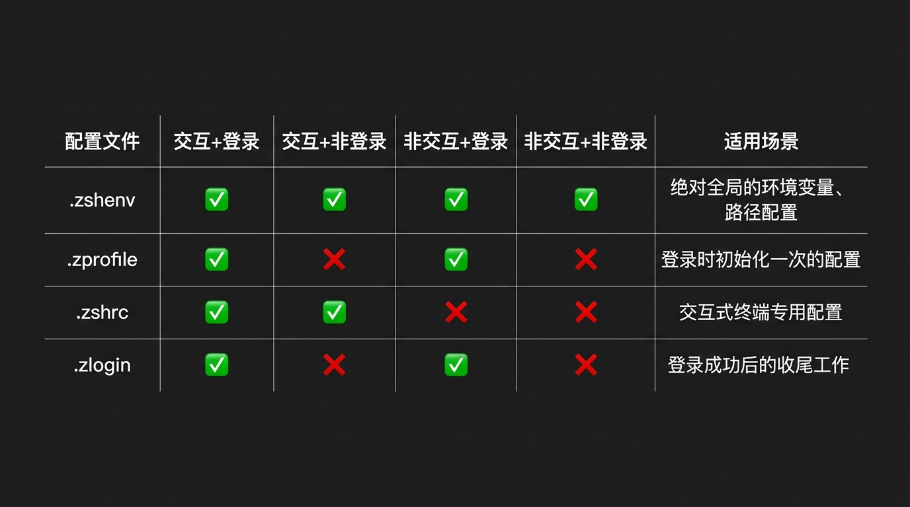

# 你真的会配置环境变量吗？

> 在 AI 时代，当 AI 帮我们跑 `flutter pub get` 等命令时，你配置的中国镜像源却神秘失效了。其实，问题不在 AI，而在于你配置环境变量的姿势。

---

## 前言

作为开发者，配置环境变量是我们几乎每天都在打交道的事情。不管是安装 Flutter、配置 Android SDK，还是设置 JDK 路径，我们最常用的操作大概就是：

打开终端，熟练地敲下：
```bash
vi ~/.zshrc
```
然后在文件末尾加上一行 `export PATH=...` 或者 `export PUB_HOSTED_URL=...`，最后 `source ~/.zshrc` 完事。

在过去，这种“一刀切”地把所有配置往 `~/.zshrc` 里塞的做法并没有什么大问题，因为我们几乎所有的命令都是在自己打开的终端窗口（交互式终端）里手动输入的。

然而，到了 **AI 编程时代**，这个习惯正在悄悄变成绊脚石。

---

## 一、诡异的现象：AI 帮我拉依赖时，镜像源失效了？

最近在用 AI Coding Agent（比如 Claude Code、Cursor，或者自建的 Agent）帮我开发 Flutter 项目时，遇到了一个诡异的现象。

我让 AI 帮我写完一个功能后，顺口给它下达了一个指令：“*帮我拉取一下依赖并跑一下测试*”。

AI 很听话，立刻在后台拉起进程去跑 `flutter pub get`。然而，等了半天，AI 却弹出了一个红色的报错：

```bash
Failed to connect to pub.dev... Connection timed out.
```

这让我纳闷了。为了加快包的下载速度，我明明已经在本地配置了 Flutter 和 Pub 的国内镜像源：

```bash
export PUB_HOSTED_URL="https://pub.flutter-io.cn"
export FLUTTER_STORAGE_BASE_URL="https://storage.flutter-io.cn"
```

而且我自己打开 Mac 的 Terminal，手动运行 `flutter pub get`，明明是一秒内就拉取完成了，镜像源工作得非常完美。为什么一到 AI 手里，镜像源就失效了，它非要傻傻地去连官方的 `pub.dev` 呢？

难道是 AI 故意绕过了我的本地配置？

其实，问题并不在 AI 身上，而在于 Zsh 对**交互式 Shell（Interactive Shell）**和**非交互式 Shell（Non-interactive Shell）**的处理机制。

---

## 二、深入剖析：Zsh 启动配置文件的加载逻辑

为了搞清楚原因，我们需要先认识 Zsh 的几个核心启动配置文件：
1. `~/.zshenv`
2. `~/.zprofile`
3. `~/.zshrc`
4. `~/.zlogin`

很多同学只知道 `~/.zshrc`，甚至分不清它和 `~/.zprofile` 的区别。事实上，Zsh 在启动时会根据**当前 Shell 的运行模式**，决定加载哪些配置文件。

这里有两个关键的维度：
- **Login Shell（登录 Shell）** vs **Non-login Shell（非登录 Shell）**
- **Interactive Shell（交互式 Shell）** vs **Non-interactive Shell（非交互式 Shell）**

我们常用的 Mac 终端（如 Terminal、iTerm2）在新建窗口时，默认启动的是 **Interactive + Login Shell**。而如果我们直接在终端里敲 `zsh`，或者运行一个脚本，启动的则是子 Shell。

不同的 Shell 模式下，配置文件的加载顺序和情况如下图所示：



> [!NOTE]
> 从图表中可以清楚地看出，只有 **`~/.zshenv`** 拥有“特权”，无论在什么模式下，它都**一定会被加载**。而大家最常用的 **`~/.zshrc`**，在非交互式 Shell 下是**完全被忽略**的。

---

## 三、破案：为什么 AI 找不到你的镜像源？

搞懂了上面的加载逻辑，前面的诡异现象也就迎刃而解了。

当 AI Agent（或者你在 VS Code 里运行的某些插件后台任务）帮我们执行 `flutter pub get` 时，它是通过类似 Node.js 的 `child_process.exec` 或 Python 的 `subprocess`，在后台静默启动了一个子进程来运行命令。

这个后台子进程，就是一个典型的 **Non-interactive + Non-login Shell**（非交互、非登录 Shell）。

此时，Zsh 启动了，但它赫然发现这并不是一个交互式终端，因此：
- 它**根本不会去读取** `~/.zshrc`！
- 你写在 `~/.zshrc` 里的 `PUB_HOSTED_URL` 和 `FLUTTER_STORAGE_BASE_URL` 环境变量，自然也就没有被注入到这个子进程中。
- Flutter 工具链找不到镜像源环境变量，只能退而求其次，去请求默认的官方源 `pub.dev`，最终在国内的网络环境下超时卡死。

不仅是镜像源，有时候 AI 帮我们跑原生 iOS 的 `pod install` 或者跑打包脚本时，提示找不到 `pod` 或 `fastlane` 命令，也是因为你的 `PATH` 变量只配在了 `~/.zshrc` 里，非交互式 Shell 拿不到正确的 `PATH`。

---

## 四、正确的配置姿势：环境变量该放哪？

既然知道了原理，我们就应该改掉“万物皆可 `.zshrc`”的坏习惯，将我们的启动配置文件进行模块化整理。

### 1. `~/.zshenv`：存放全局环境变量与 PATH

所有需要跨进程、跨终端、无论在什么环境下都必须生效的变量，都应该写在 `~/.zshenv` 中。

例如，你可以把 Flutter 镜像源、Java/Android 路径以及 `PATH` 写入其中：

```bash
# 打开或创建 ~/.zshenv
vi ~/.zshenv
```

写入以下内容：
```bash
# Flutter & Pub 镜像源（确保 AI 也能顺利拉取依赖）
export PUB_HOSTED_URL="https://pub.flutter-io.cn"
export FLUTTER_STORAGE_BASE_URL="https://storage.flutter-io.cn"

# Android SDK 路径
export ANDROID_HOME="$HOME/Library/Android/sdk"

# Java 路径
export JAVA_HOME="/Library/Java/JavaVirtualMachines/zulu-17.jdk/Contents/Home"

# 统一拼接 PATH
export PATH="$PATH:$ANDROID_HOME/tools:$ANDROID_HOME/platform-tools:$HOME/.pub-cache/bin"
```

> [!CAUTION]
> **特别注意**：由于 `~/.zshenv` 在任何 shell 启动时都会被加载（包括后台执行单个简单命令），因此**千万不要**在这里面写任何有屏幕输出的命令（如 `echo`），也不要写任何耗时很长的脚本初始化逻辑，否则可能会破坏 `rsync`、`scp` 等依赖干净输出的后台程序，或者导致系统命令响应变慢。

### 2. `~/.zshrc`：存放交互式终端专属配置

这里应该只存放你平时坐在电脑前、看着屏幕敲命令时才需要的功能。

例如：
```bash
# 开启 oh-my-zsh 及其主题
export ZSH="$HOME/.oh-my-zsh"
ZSH_THEME="robbyrussell"
plugins=(git zsh-syntax-highlighting zsh-autosuggestions)
source $ZSH/oh-my-zsh.sh

# 常用别名（Alias）- AI 并不需要这些别名
alias gs="git status"
alias gp="git push"
alias gc="git commit -m"
alias fpg="flutter pub get"

# 自定义终端提示符或交互快捷键
```

### 3. `~/.zprofile`：只在登录时初始化一次的配置

在 macOS 上，由于默认终端窗口是 Login Shell，`.zprofile` 也会在新窗口打开时被调用。如果你有一些只需要在登录（或新建终端窗口）时初始化一次、但又比较耗时的命令，可以考虑放在这里。不过对于绝大多数普通开发者而言，合理划分 `~/.zshenv` 和 `~/.zshrc` 就已经完全足够了。

---

## 写在最后

在 AI 时代，我们与计算机的交互界面正在从“人机交互”向“Agent 代理交互”转变。AI Agent 就像是我们的数字分身，代替我们在后台默默执行着大量的工程命令。

在这个背景下，很多以前被我们忽略的本地配置细节（比如 Shell 的加载机制、环境变量的分层管理）开始暴露出隐患。

弄懂 `zshenv` 与 `zshrc` 的差别，虽然只是一个微小的知识点，但却能让我们的开发环境更加规范，也能让我们的 AI 助手工作得更加顺畅、高效。

赶紧检查一下你的 `~/.zshrc`，把里面的全局环境变量搬家到 `~/.zshenv` 吧！

---

*本文首发于微信公众号「iOS观之」（微信号：run88184），欢迎关注。*
