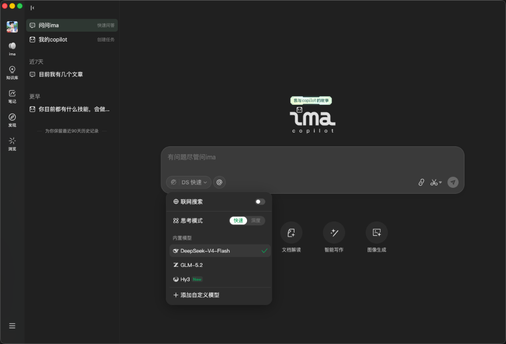
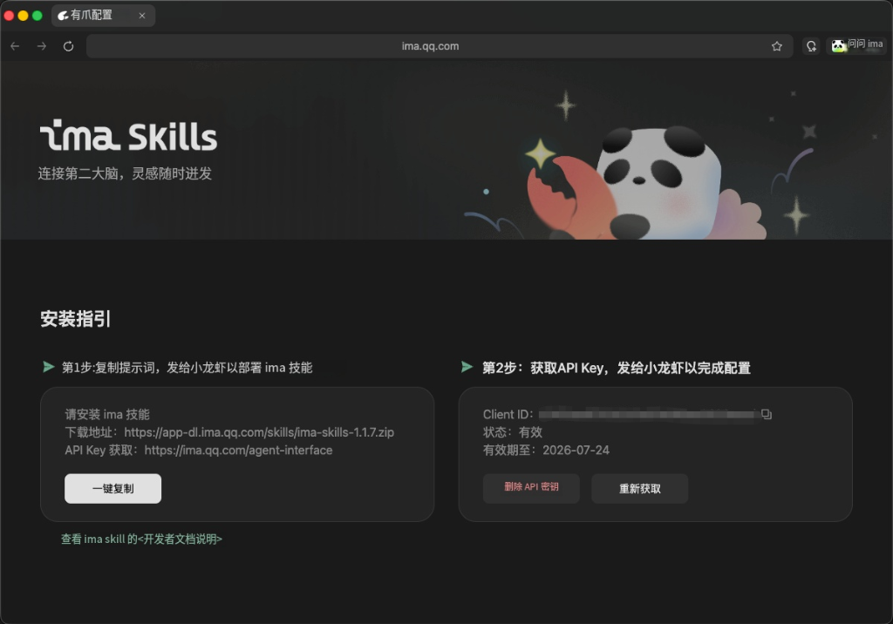

# 从“信息焦虑”到“第二大脑”：为什么你现在需要一个 AI 知识库？

> 如何利用 AI 知识库打破“只收藏不阅读”的怪圈，并用腾讯 ima.copilot 打造专属于你的个人智能工作台。

---

## 前言

不知道你有没有这样的体验：
- 看到一篇深度好文，赶紧点击“微信收藏”或加入浏览器收藏夹，心里想着“以后慢慢看”，但从此再也没打开过；
- 为了一个课题或项目下载了几十篇 PDF 论文和行业报告，却在繁重的阅读任务面前一拖再拖；
- 电脑里堆满了会议纪要、工作文档、参考资料，想找某一个具体观点时，却怎么也搜不到。

这就是典型的“数字囤积症”。在信息爆炸的时代，我们每天都在被海量信息淹没。我们误以为“收藏了就等于学会了”，但实际上，那些沉睡在收藏夹里的资料只会在无形中增加我们的认知负荷和信息焦虑。

如何打破这个怪圈？答案是：**构建一个属于你自己的 AI 知识库（“第二大脑”）。**

---

## 一、从“文件柜”到“智能秘书”：什么是 AI 知识库？

传统的知识库，本质上是一个“数字文件柜”。你需要手动分类、打标签、建立目录，一旦文件多了，维护成本极高，检索也极其依赖精准的关键词匹配。

而 **AI 知识库**（基于 RAG，即检索增强生成技术），则是为你配备了一位**“24小时无休的智能秘书”**。

它与传统分类整理相比，有着质的飞跃：

| 维度 | 传统知识库（分类文件夹/收藏夹） | AI 知识库（智能工作台） |
| :--- | :--- | :--- |
| **整理成本** | 高（需手动分类、打标签、建目录） | 极低（AI 自动理解语义，支持无结构导入） |
| **检索方式** | 机械（依靠文件名或精准关键词匹配） | 智能（支持模糊语义搜索、自然语言问答） |
| **消化效率** | 慢（需要肉眼通读整篇文章/报告） | 快（AI 自动提炼摘要、生成脑图、甚至播客） |
| **知识输出** | 难（需要人脑重新检索、构思与拼接） | 易（AI 基于已有知识辅助大纲生成、润色写作） |

简单来说，你不需要再去纠结“这篇文章该放哪个分类文件夹”，只需要把资料扔进去。当你需要时，用平常说话的方式问它，它就能在几秒钟内翻遍所有文档，把最准确的答案整理好呈现在你面前，并附带信源出处。

---

## 二、腾讯 ima.copilot：打破微信生态壁垒的 AI 个人知识库神器

市面上的 AI 知识库工具不少，但对于国内的知识工作者、开发者和职场人来说，有一个无法避开的痛点——**我们很大一部分的优质信息源都在微信生态内**（公众号文章、微信群里的 PDF 或 Word 格式文件）。

很多海外或小众的 AI 工具很难顺畅地导入微信里的内容。

近期腾讯推出的 **ima.copilot**（以下简称 ima），恰恰击中了这一痛点，成为目前最值得推荐的 AI 个人知识库神器之一。

### 1. 深度植入微信生态，给“沉睡资产”一键激活

作为腾讯自家的产品，ima 拥有得天独厚的微信连接能力。
- **公众号文章轻松剪藏**：你可以在手机端通过“用 IMA 打开”或直接发送给 ima 助手，将看到的优质公众号文章一键收藏。
- **微信文件直接同步**：微信群里传的各种工作文档、需求说明，可以无缝同步到电脑端的知识库中。
- **元宝联动与信源增益**：ima 的公开知识库已与腾讯元宝联动。你在元宝提问时，AI 能够引用优秀作者在 ima 里面沉淀的专业内容作为信源，实现更精准的回答与追溯。

### 2. 内置主流“多模型天团”，还支持自定义扩展

在核心的 AI 推理和问答能力上，ima 彻底打破了单一模型的局限。从它的模型选择菜单中，我们可以看到目前最顶级的模型配置：
- **DeepSeek-V4-Flash**：以极快的响应速度和智能问答见长，且支持开启**思考模式**（可在快速和深度思考间灵活切换，在需要进行复杂逻辑推理时一键开启）；
- **智谱 GLM-5.2**：国内最顶尖的基座大模型之一，理解能力和中文生成质量非常扎实；
- **腾讯混元 Hy3**（最新加入）：作为主场大模型，在微信生态内容理解、大文本消化及多轮对话中体验极佳。

更良心的是，ima 还提供了**“添加自定义模型”**功能。无论你是大模型折腾控还是对特定 API 有偏好，都可以直接配置自己习惯的第三方大模型，赋予了这个个人知识库无限的扩展潜力。




### 3. “搜、读、写”一体化的极简工作流

ima 的设计理念非常清晰，它围绕知识处理的生命周期，打造了完整的闭环：

- **【搜】智能搜索与问答**：它不仅能搜全网，最强大的是能搜你的“专属知识库”。比如你可以问它：“我上个月收集的那几篇关于 SPM 迁移的文章里，关于 CocoaPods 依赖冲突是怎么解决的？”它会瞬间定位并给出解决方案。
- **【读】多模态深度解读**：支持 PDF、Word、网页、图片甚至音频格式。导入长文档后，AI 不仅能一秒给出概要，还能自动绘制**思维导图**。甚至它还能把枯燥的文字直接转换成**有声播客**，让你在通勤路上用耳朵“听完”一篇行业报告。
- **【写】AI 辅助创作**：基于知识库的内容，你可以直接让 AI 帮你生成 PPT 大纲、周报、或者是新文章的草稿，真正做到了“输入-内化-输出”的闭环。

### 4. 开发者福音：用 ima-skills 赋能 Claude、Codex 等主流 Agent

除了面向大众用户的问答与写作，ima 还为开发者和 AI 极客们准备了一个硬核大招——**ima-skills**。
通过它，你可以将自己在 ima 知识库里沉淀的个人专属知识、项目设计规约、或是特定的 API 手册，无缝集成到 Claude、Codex（如 Claude Code 等）等目前主流的 AI 编程 Agent 中。
这相当于给你的 AI 编程助手挂载了一个“外置大脑”。在编写代码或做项目重构时，AI Agent 可以直接调取 ima-skills 中的本地知识，确保生成的代码完全符合你的技术栈特征和业务逻辑规范，极大地提升了 AI Coding 的精准度。

配置到 Claude (如 Claude Code) 的方法其实非常简单，你甚至不需要手动改写配置文件。直接对 Claude 复制发送以下安装指引提示词即可：

```text
请安装 ima 技能
下载地址：https://app-dl.ima.qq.com/skills/ima-skills-1.1.7.zip
API Key 获取：https://ima.qq.com/agent-interface
```

发送后，Claude 会自动识别并下载部署技能包。根据它的提示，随后提供你在官方页面获取到的 Client ID 与 API Key 即可绑定激活。

配置完成后，引入了 `ima-skills` 的 Claude 就可以直接在终端以自然语言指示它：“*查一下我 ima 知识库里关于 SPM 迁移踩坑的笔记*”，甚至“*把当前重构好的类文件同步备份到我的 ima 知识库中*”。知识库瞬间化身为你的编程外挂大脑！

官方提供的安装与 API Key 凭证页面非常直观，提供了技能一键复制和部署指引：



---

## 三、如何开始构建你的“第二大脑”？

如果你想开始尝试用 ima 构建自己的知识库，建议遵循以下三个步骤：

1. **聚焦 1~2 个核心领域**：不要试图把所有的网页都塞进去。先从你当前最需要的领域（比如“SwiftUI 进阶技术”或“AI 辅助编程实践”）开始，导入相关的文档和优质文章。
2. **重塑阅读流**：把 ima 作为你的信息中转站。每天在微信、浏览器上看到的好文章，随手利用剪藏插件或微信分享导入，让它自动在后台为你归档。
3. **把提问当成习惯**：在开始一项新工作或写代码前，先在知识库里问一下 AI。你会惊喜地发现，那些你曾经看过去忘掉的知识，正在被 AI 以全新的方式激活。

---

## 写在最后

管理学大师彼得·德鲁克曾说：“知识必须不断地被改进、挑战和增加，否则它就会消失。”

AI 时代的个人竞争力，不再取决于你“脑子里记住了多少知识”，而取决于你“如何调用和连接知识”。把记忆的负担交给 AI 知识库，把思考与创造留给自己。

如果你也深受信息焦虑的困扰，不妨今天就下载一个 ima 客户端，从导入第一篇公众号文章开始，搭建专属于你的第二大脑。

目前 ima 对主流端提供了极其完善的支持，包括 Mac、Windows、微信小程序、iOS、Android 甚至 HarmonyOS 鸿蒙端等，覆盖了所有的办公和移动阅读场景：


---

*本文首发于微信公众号「iOS观之」（微信号：run88184），欢迎关注。*
