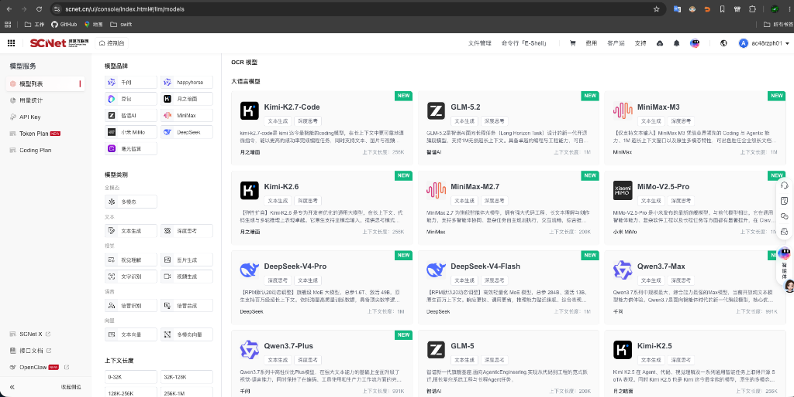
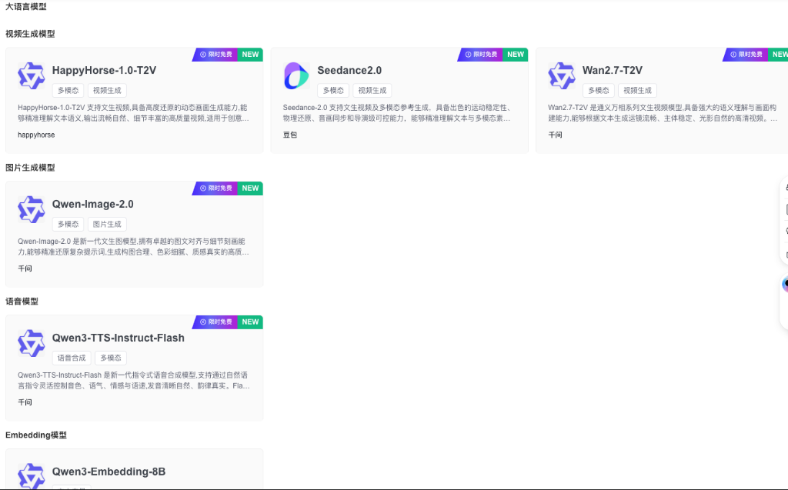
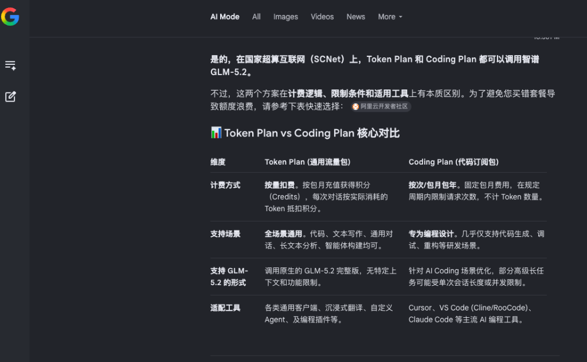
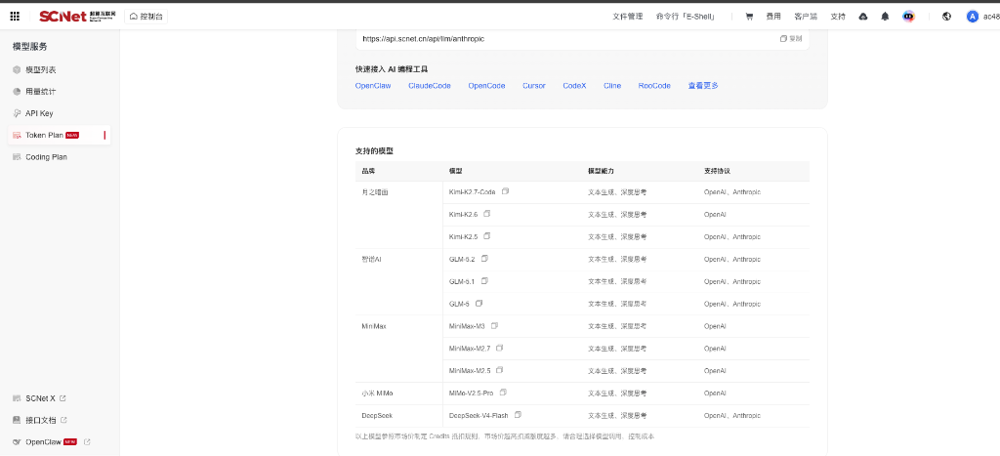
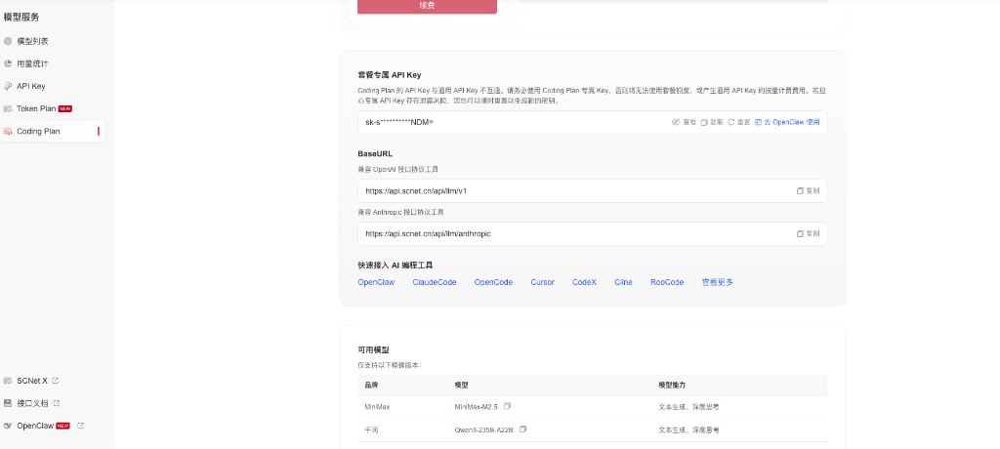
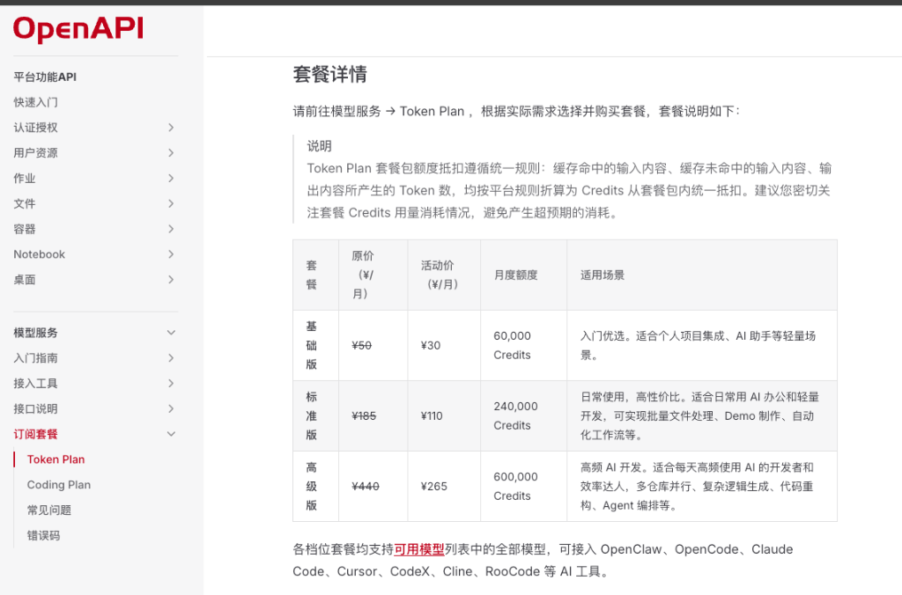
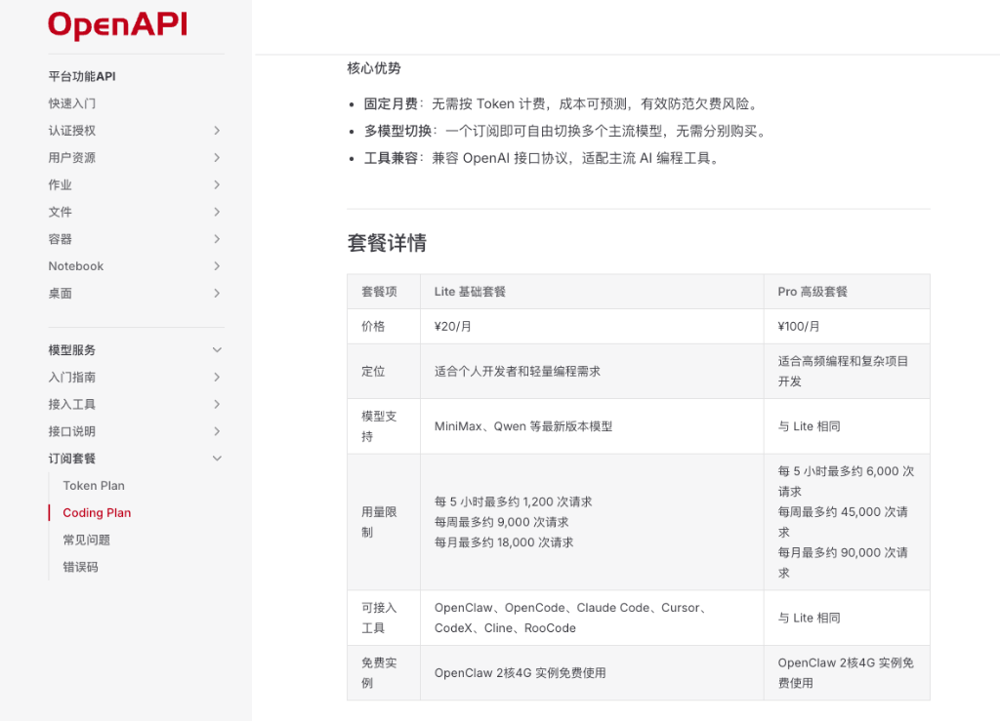
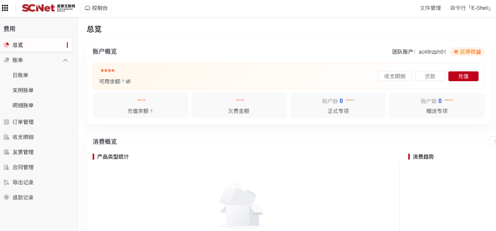

# 国家超算互联网大模型服务避坑指南:Token Plan 与 Coding Plan 到底有什么区别?

> 国内主流大模型的一站式"国家队"平台--国家超算互联网(SCNet)怎么用?本文带你理清它特殊的计费规则与模型支持差异,避开"买错"套餐的陷阱。

---

## 前言

随着国内大语言模型的百花齐放,开发者们在日常搬砖中往往需要调用各种不同厂商的 API。但逐个去各家平台充值、管理 API Key 实在繁琐。

最近,一个名为**国家超算互联网**（SCNet，官网：https://www.scnet.cn）的平台逐渐进入开发者的视野。它不仅汇聚了国内主流的顶级大模型,而且因为有着"国家队"的算力背书与补贴,价格非常有竞争力。

不过,作为一个刚起步不久的平台,超算互联的用户使用基数还不算特别大,它的套餐规则和使用逻辑也相对复杂。很多刚接触的人一不小心就会踩坑。今天我们就来盘一盘它的核心规则，特别是备受关注的两个套餐到底有何不同。

---

## 一、国家超算互联网(SCNet)的来历

国家超算互联网(SCNet)是由科技部发起,联合国内多家国家超算中心、高校、科研院以及科技企业共同建设的算力服务平台。它的核心愿景是将全国零散的超算算力、数据资源、软件和应用连接起来,构建一个统一的"国家算力网",让算力像电力一样"即开即用"。

虽然它的名字叫"超算",但除了传统的科学计算、高能物理等高性能计算(HPC)任务外,为了适配 AI 时代的到来,SCNet 近期也大力建设了 **AI 模型服务平台**。

在这个平台上,国内主流的大模型几乎一网打尽。

---

## 二、丰富的模型服务

在 SCNet 控制台的"模型服务"板块,我们可以看到一个极其强大的模型库:

*   **月之暗面**:Kimi-K2.7-Code, Kimi-K2.6, Kimi-K2.5
*   **智谱 AI**:GLM-5.2, GLM-5, GLM-5.1
*   **MiniMax**:MiniMax-M3, MiniMax-M2.7, MiniMax-M2.5
*   **DeepSeek**:DeepSeek-V4-Pro, DeepSeek-V4-Flash
*   **通义千问**:Qwen3.7-Max, Qwen3.7-Plus
*   **其他厂商**:如小米 MiMo-V2.5-Pro 等

如此丰富的品类,再加上平台提供兼容 OpenAI 与 Anthropic 格式的统一 API 接口,这让它成为了极佳的大模型聚合网关。

> *注：模型列表和版本号可能随平台更新而变化，以 SCNet 控制台实际展示为准。*

此外，平台还有一个极其吸引人的隐藏福利——**目前有许多前沿的视频生成、图片生成和语音合成模型在提供限时免费调用！**

在控制台的模型列表中，还有很多标有紫色“**限时免费**”标签的模型均可免费体验，例如：Seedance2.0

*(控制台里标记为限时免费的多模态与音视频模型)*

---

## 三、新手最易踩的坑:Token Plan 与 Coding Plan 规则解析

超算互联的模型计费有两套完全平行的方案:**Token Plan** 和 **Coding Plan**。

这两个套餐在账户中**可以同时存在**,使用**不同的 API Key** 进行独立管理,但它们在计费模式和**能够调用的模型**上有着天壤之别!

很多新手在购买前没有仔细对比,直接去问 AI(比如 Google Gemini),结果被 AI 的"幻觉"给误导了。

### 1. 让人哭笑不得的"AI 幻觉"

我刚开始对于购买哪个 Plan 也有些吃不准,于是便习惯性地去咨询了 Google Gemini:

> **提问**:"在国家超算互联网(SCNet)上,Token Plan 和 Coding Plan 都可以调用智谱 GLM-5.2 吗?"

Gemini 极其自信地给出了肯定答复,甚至制作了一份精美的对比表格,声称两个 Plan 都可以调用智谱 GLM-5.2,仅仅是计费方式和长文本并发限制有区别:

然而,**实际测试下来,这完全是 AI 的胡编乱造!**

如果轻信了 AI 的建议购买了 Coding Plan 去配置 AI 编程工具,你将会直接面临接口报错、模型不存在的尴尬境地。

### 2. 它们支持的模型其实完全不同!

我们来看看官方控制台的真实规则(付款后才能看到):

#### 方案 A:Token Plan (通用流量包)

*   **计费方式**:按量扣费。用户通过包月或充值获得积分(Credits),每次 API 对话根据输入和输出的真实 Token 数量折算抵扣积分。
*   **支持模型**:**全量大模型支持**。你可以调用包含智谱 GLM-5.2、Kimi-K2.7-Code、DeepSeek-V4-Flash 等在内的所有顶级模型。

*(Token Plan 拥有广泛的模型支持列表)*

#### 方案 B:Coding Plan (代码订阅包)

*   **计费方式**:按次/周期订阅。类似于无限流量包(在规定周期内限制总请求次数,不计 Token 数量)。非常适合频繁交互的 Cline、Claude Code、Cursor 等编程辅助工具。
*   **支持模型**:**仅支持极少数精简/特定版本模型!**

从控制台的 Coding Plan 详情页可以清晰看到,它底部的"可用模型"列表竟然只有可怜的两个:
1.  **MiniMax-M2.5**
2.  **Qwen3-235B-A22B**

*(Coding Plan 极度精简的可用模型列表,并不支持 GLM-5.2 或 Kimi 等大模型)*

这意味着,如果你买了 Coding Plan,你的 API Key **根本无法调用** 智谱 GLM-5.2、Kimi 或 DeepSeek-V4 等顶级模型。

### 3. 资费详情与"概不退款"的硬规定

在资费方面,两个套餐的定价策略也有很大差异，但其实除了购买订阅套餐，平台还支持直接充值：

*   **Token Plan (通用流量包)**:提供包月 Credits 额度。例如活动价下,基础版为 ¥30/月(含 60,000 Credits),标准版为 ¥110/月(含 240,000 Credits),高级版为 ¥265/月(含 600,000 Credits)。具体资费见下图:

*(Token Plan 套餐详情与活动价)*

*   **Coding Plan (代码订阅包)**:主打固定月费不计 Token。Lite 基础套餐只需 ¥20/月,可提供每月最多 18,000 次请求(平均每天 600 次);Pro 高级套餐 ¥100/月,每月最多 90,000 次请求。

*(Coding Plan 套餐详情与额度)*

*   **直接账户充值 (按量付费)**:除了上述两种需要包月订阅的 Plan 之外,SCNet 还支持更加灵活的直接充值方式。在控制台的"费用 -> 总览 -> 充值"中,你可以直接往账户里充值任意金额。充值的可用余额可直接用于全部大模型 API 的调用,同样按真实的 Token 消耗扣费。

*(控制台直接充值与费用总览)*

相比于按月购买套餐,**如果你只是轻量级使用,或者偶尔才需要调用顶级大模型,直接充值会是更合适的选择**。因为包月套餐内的 Credits 到期后如果不续费可能会清零,而直接充值的账户余额长期有效,用多少扣多少,没有任何额度过期的心理焦虑。

**但这里有两个极其重要的"避坑点":**

> **⚠️ "避坑点"：**
> 
> 1. **模型极其有限**：虽然 Coding Plan 便宜且额度大，但它绑定的可用模型仅有两个（即 MiniMax-M2.5 和 Qwen3-235B-A22B）。
> 2. token plan虽然模型很多，但也不是全部支持，只有表格内的，我一开始还以为他们表格漏掉了deepseek-v4-pro,结果实测下来确实是不支持deepseek-v4-pro，但deepseek-v4-flash是支持的
> 3. **一经售出，概不退款**：这是超算互联平台非常硬性的规则——一旦支付成功，无论是订阅了套餐，还是充值了账户余额，即使你完全没有使用过，也一律不支持退款！

我就是因为看到 Coding Plan 便宜,且以为"能调用的模型都一样",付完钱进去才发现根本无法在 IDE 里调用 GLM-5.2 等模型。按我们现在主流使用的模型来看,这两个精简模型几乎派不上大用场。结果想退款还被官方明确拒绝,白白损失了 20 块钱。

---

## 写在最后

现在 AI 沟通虽然很方便,但还是得多留一个心眼,去看看官方文档与模型支持列表,永远比直接询问 AI 更靠谱。国家超算互联网为我们提供了一个极其优秀的算力桥梁。对于想体验 GLM-5.2 但又抢不到智谱官方coding plan的朋友,不妨去超算互联试试直接充值使用。

---

*本文首发于微信公众号「iOS观之」(微信号:run88184),欢迎关注。*
