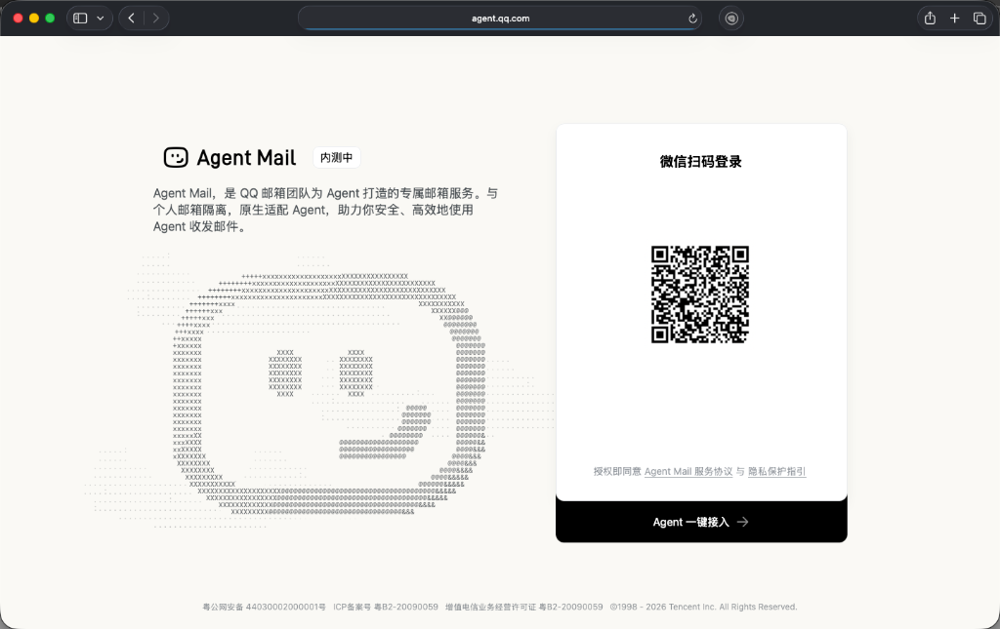
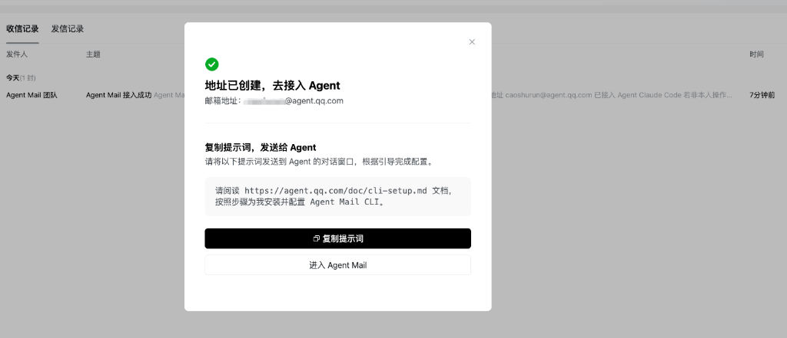
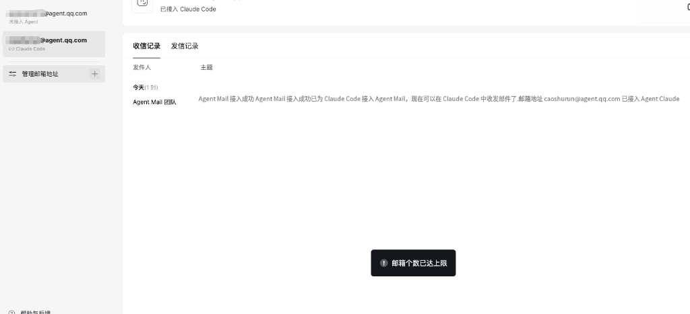

# 腾讯低调内测 Agent Mail：QQ邮箱团队为 AI Agent 打造的专属邮箱

## 前言

AI Coding 浪潮之下，Agent 助手已经成了很多开发者的日常标配。我们习惯了让 AI 帮我们写代码、调接口，甚至是直接在终端里跑命令。

你有没有想过让 AI 帮你处理日常工作里的其他琐事，比如**收发邮件**？

最近，腾讯 QQ 邮箱团队非常低调地内测了一款新产品——**Agent Mail**（官方网址：https://agent.qq.com）。这是一个专门为 AI Agent 打造的”原生邮箱”服务，很好地解决了上面的问题。

---

## 一、什么是 Agent Mail？

从内测页面（如下图所示）可以看到，**Agent Mail** 是 QQ 邮箱团队专门为 AI Agent 构建的邮箱服务。

*(Agent Mail 扫码登录页，主打与个人邮箱隔离)*

根据官方介绍，它的核心定位非常清晰：

1. **与个人邮箱隔离**：它不是你的个人 QQ 邮箱，而是一个全新的、独立的邮箱账号。这意味着你不用担心 AI 在收发邮件时会泄露你个人邮箱里的隐私信息。
2. **原生适配 Agent**：专为大模型和 Agent 的交互模式而设计，能够让 AI 安全、高效地代你收发和整理邮件。

---

## 二、快速配置与接入

登录 Agent Mail 后，系统会为用户生成一个专属的 Agent 邮箱地址。

它会贴心地提供一段发给 Agent 的引导提示词：

> *“请阅读 https://agent.qq.com/doc/cli-setup.md 文档，按照步骤为我安装并配置 Agent Mail CLI。”*

*(地址创建成功后的接入引导界面)*

既然是“Agent 邮箱”，我们不需要自己去手动敲命令配置。你只需要把这句提示词直接复制并发送给你的 Agent，剩下的工作它就会全自动帮你搞定——它会自己阅读文档，从全局安装 `agently-cli` 命令行工具，到配置 Skill 扩展。

唯一需要你动动手指的，就是当 Agent 在终端发起 OAuth 登录流程时，点击它输出的浏览器授权链接，扫码确认即可。

授权绑定成功后，你的 AI 助手就拥有了操作这个邮箱的全部权限。你可以随时像使唤秘书一样，直接用自然语言吩咐它干活：

*   *“帮我给张三发一封邮件，告诉他下周的会议时间改到了周二上午。”*
*   *“我最近收到了哪些邮件？帮我简要整理一下重点。”*
*   *“把今天关于项目进展的邮件归纳成一份日报发送给老板。”*

### 值得关注的内测小细节

深入体验后，我还发现了两个非常有意思的内测细节：

1. **已接入状态反馈**：当你的 AI 编程助手（如 Claude Code）成功接入邮箱后，Agent Mail 的管理端后台页面上会非常直观地显示出反馈，如页面顶部会亮出”**已接入 Claude Code**”的标志。
2. **邮箱创建上限**：目前内测阶段，**一个账号（微信扫码）最多可以创建 2 个专属的 Agent 邮箱**。

*(管理端页面中的接入反馈与数量上限提示)*

---

## 三、专属 Agent 邮箱带来的改变

腾讯这次推出的 Agent Mail，看似低调，实则回应了很多大模型落地应用的关键问题：

*   **安全防线**：传统的个人邮箱往往绑定了我们极多的敏感账号与隐私信件。把个人邮箱密码或授权码透露给 AI 具有极高的风险。Agent Mail 的物理隔离，给 AI 划定了安全边界。
*   **开发零门槛**：以往想要通过代码连接邮箱，需要处理复杂的 IMAP/SMTP 握手和 MIME 协议格式。而 `agently-cli` 将这一切封装成了开箱即用的指令，大大降低了 Agent 的开发与适配门槛。
*   **极佳的主动性**：随着 Agent 越来越具备主动性和工具调用（Tool Use）能力，拥有一个合法的“网络身份”（专属邮箱）是它融入人类社会化协作工作流的必经之路。

---

## 写在最后

从 ima 知识库再到如今的 Agent Mail，腾讯最近在 AI 工具链上的尝试不仅动作频频，而且往往切中了用户与开发者的真实需求。

如果你也正在搭建自己的 AI 工作流，或者想让你的 Coding Agent 拥有自动发送构建报告、邮件提醒等能力，不妨去 https://agent.qq.com 申请一个属于你 AI 的专属邮箱吧！

---

*本文首发于微信公众号「iOS观之」（微信号：run88184），欢迎关注。*
