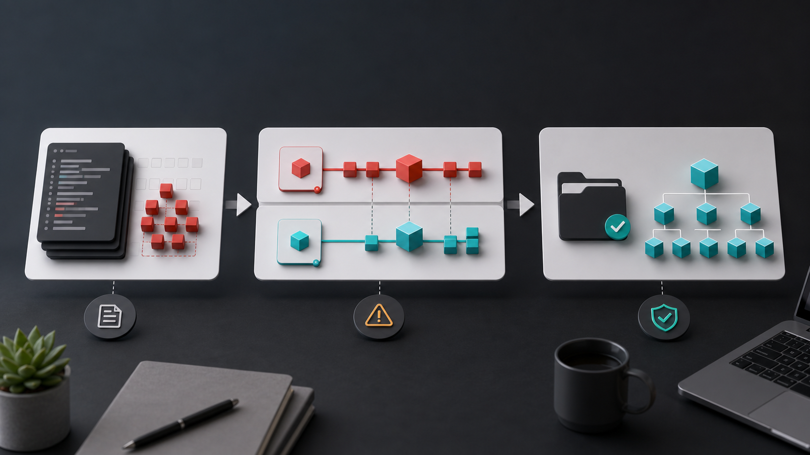
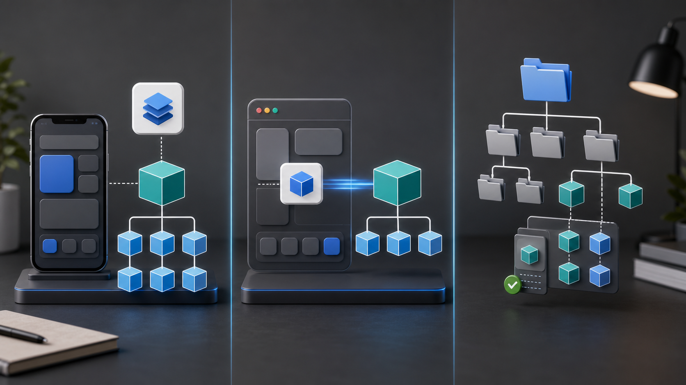

# CocoaPods 进入维护模式：iOS 项目的 SPM 迁移笔记

> 这是一次从 Podfile 迁到 Package.swift 的记录：为什么要迁、哪些依赖先迁，Flutter 项目又该怎么处理。

---

## 前言

先说背景。这次迁移不是为了追新工具，而是 CocoaPods 自己先变了。

2024 年 8 月，CocoaPods 官方在 [Support & Maintenance Plans](https://blog.cocoapods.org/CocoaPods-Support-Plans/) 里说得很直白：项目进入 maintenance mode。几个月后，官方又公布了 [trunk 只读计划](https://blog.cocoapods.org/CocoaPods-Specs-Repo/)：2026 年 12 月 2 日之后，CocoaPods trunk 不再接受新的 Podspec 和版本发布。Podfile 今天不会失效，但它已经不适合继续当默认依赖通道。

Flutter 这边也开始收口。[官方文档](https://docs.flutter.dev/packages-and-plugins/swift-package-manager/for-app-developers) 写明，从 Flutter 3.44 开始，iOS 和 macOS 原生依赖默认由 Swift Package Manager（SPM）管理，CocoaPods 只保留维护模式；以后也不会再允许关闭 SwiftPM。更直接的是 Flutter 仓库里的 proposal：[SwiftPM Deprecate CocoaPods](https://github.com/flutter/flutter/issues/168015)。里面明确写到，等 SwiftPM 在 Flutter 里完整支持后，Flutter 会停止支持 CocoaPods，包括从 `flutter doctor` 移除 CocoaPods、在生态迁移完成后移除 CocoaPods 支持、关闭 CocoaPods 相关 issue。

这篇先把背景说清楚，后面直接讲怎么迁：普通 iOS 项目怎么处理依赖，Flutter App、Module、Plugin 又分别怎么落地。

我后来花了两周，把项目里的依赖分批迁过去。这篇就按实际迁移顺序写，主要回答几个问题：

1. 为什么现在有必要迁到 SPM；
2. SPM 是什么，`Package.swift` 怎么看；
3. 真实项目怎么迁，哪些地方最容易出问题。

如果你手上还有一份几年没动过的 `Podfile`，可以从这里开始拆。

---

## 一、为什么现在要切到 SPM

公告是一回事，项目里真正有感觉的是另一回事：依赖文档、Xcode 工具链、Flutter 工程模型，都在往 SPM 靠。


### 1. 新库的文档越来越偏 SPM

观察一下近几年主流第三方库的接入方式：

- Alamofire：同时支持 CocoaPods 和 SPM。
- SnapKit：已支持 SPM。
- Kingfisher：支持 SPM。
- Lottie-iOS：早已支持 SPM。
- Firebase iOS SDK：Google 早在几年前就提供 SPM 接入，并持续完善。
- Swift Collections：Apple 官方 Swift 包，天然通过 SPM 分发。

问题已经不是 CocoaPods 能不能装。很多库的文档、示例、issue 回复都先按 SPM 写。继续用 CocoaPods 也能跑，但排查问题时经常要多绕一圈。

### 2. Xcode 里的 SPM 已经能用了

从 Xcode 11 开始，Apple 就把 Swift Package 集成进了 Xcode。现在日常用下来，几个地方已经比较稳：

- 项目内可以直接添加、更新、重置 package。
- `Package.resolved` 可以跟随项目提交，CI 和本地更容易对齐版本。
- `binaryTarget` 能覆盖不少商业 SDK 场景。
- 多个本地 package 放在一个 workspace 里协作，体验比以前顺很多。

CocoaPods 这边就麻烦一点。每次 Xcode 大版本更新，社区里总会冒出一波「pod install 卡住」「Build Phases 跑飞」之类的问题。原因不复杂：CocoaPods 通过 `Pods.xcodeproj`、xcconfig 和脚本阶段接入工程，和 Xcode 原生依赖模型不是一条线。Xcode 改一点构建细节，它可能就要跟着补。

---

## 二、SPM 是什么

### 1. 一句话定义

Swift Package Manager（SPM）是 Swift 官方工具链里的包管理工具。它最早随 Swift 开源体系一起出现，目标很直接：用 Swift 工具链管理 Swift 代码的依赖和构建。

它不是第三方工具，也不是社区项目。对 Swift 项目来说，这就是官方路线。

### 2. 和其它包管理的对比

先和几个常见包管理工具放在一起看：

| 工具 | 生态 | 配置文件 | 工具链语言 |
|---|---|---|---|
| **CocoaPods** | iOS / macOS | `Podfile`（Ruby DSL） | Ruby |
| **Carthage** | iOS / macOS | `Cartfile`（纯文本） | Swift 脚本 + xcodebuild |
| **SPM** | Swift 全平台 | `Package.swift`（Swift DSL） | Swift |
| **npm** | Node.js | `package.json` | JavaScript |
| **Cargo** | Rust | `Cargo.toml` | Rust |
| **Maven** | JVM | `pom.xml` | XML |

记住这几条就够用了：

1. `Package.swift` 本身是 Swift manifest，可以写常量和少量条件逻辑，但不建议把它写成复杂脚本。
2. SPM 理解 Swift 的模块系统和 `PackageDescription` API。
3. 它不只服务 iOS。macOS、tvOS、watchOS、visionOS、Linux 都在覆盖范围内。

### 3. SPM 日常使用的几个好处

- 不需要额外装 Ruby，也不需要维护 Carthage 那套 xcodebuild 脚本链。
- CI 上可以缓存 package 解析和构建产物。
- 多个本地 package 一起开发时，不用再把依赖关系塞进 Podfile 里反复绕。

---

## 三、先看懂 Package.swift

理解 SPM，先看 `Package.swift`。下面这个例子够日常项目参考：

```swift
// swift-tools-version: 5.9
import PackageDescription

let package = Package(
    name: "MyAppKit",
    platforms: [
        .iOS(.v15),
        .macOS(.v13)
    ],
    products: [
        .library(name: "MyAppKit", targets: ["MyAppKit"]),
        .executable(name: "myapp-cli", targets: ["MyAppCLI"])
    ],
    dependencies: [
        .package(url: "https://github.com/Alamofire/Alamofire.git", from: "5.8.0"),
        .package(url: "https://github.com/SnapKit/SnapKit.git", from: "5.7.0"),
        .package(name: "LocalTools", path: "../LocalTools")
    ],
    targets: [
        .target(
            name: "MyAppKit",
            dependencies: [
                .product(name: "Alamofire", package: "Alamofire"),
                .product(name: "SnapKit", package: "SnapKit")
            ],
            resources: [.process("Resources")]
        ),
        .executableTarget(
            name: "MyAppCLI",
            dependencies: ["MyAppKit"]
        ),
        .testTarget(
            name: "MyAppKitTests",
            dependencies: ["MyAppKit"]
        )
    ]
)
```

### 1. 先认清四个概念

| 概念 | 含义 | 类比 |
|---|---|---|
| **Package** | 整个仓库，描述自身元信息、依赖、产物 | `Podfile` + `Podspec` 的合体 |
| **Product** | 这个 Package 对外暴露的可消费单元（库或可执行文件） | Pod / `subspec` 对外暴露的模块 |
| **Target** | 实际的源代码模块，可以互相依赖 | Xcode 里的 `.target` |
| **Dependency** | 外部依赖，远程 Git 仓库、本地路径、二进制 zip 都行 | `pod 'XXX'` |

### 2. 几个容易漏的小点

- `// swift-tools-version: 5.9` 声明的是 SwiftPM manifest API 版本。Swift 6 工具链下可以写 `6.0`。
- `from: "5.8.0"` 的含义是 `5.8.0 ≤ version < 6.0.0`，按 SemVer 解析。
- `.product(name:)` 引用的是外部库的具体 product。一个 Package 可以暴露多个 product，不是整个仓库都要拉进 target。
- `resources: [.process(...)]` 会把普通资源打进当前 target 的 resource bundle。部分 Apple 平台常见资源类型会被自动处理。

---

## 四、迁移实战：从 Podfile 到 Package.swift

下面是我实际走过的迁移路径。别一上来就删 `Podfile`。先切稳定依赖，再处理历史包。



### 1. 步骤一：盘点现状

迁移前，先把现有依赖拉一份清单。我一般先从 `Podfile.lock` 下手：

```bash
awk '/^  - / {gsub(/^[[:space:]]*- /, ""); sub(/ .*/, ""); sub(/:.*/, ""); print}' Podfile.lock | sort -u
```

这份清单包含直接依赖和传递依赖。真正排迁移顺序时，还要回到 `Podfile` 看一眼：哪些是你主动声明的，哪些只是被带进来的。

对每个依赖回答三个问题：

| 问题                   | 答不出时怎么办                                              |
| -------------------- | ---------------------------------------------------- |
| 这个库有没有 SPM 支持？       | 查 GitHub README，搜 `Package.swift`                    |
| 如果没有，最接近的替代是什么？      | 查 Swift Package Index（https://swiftpackageindex.com） |
| 是不是只发了二进制 framework？ | 用 `.binaryTarget` 接入                                 |

这个阶段我用得最多的是 Swift Package Index。一个库有没有 SPM 支持、支持哪些平台、release 情况怎么样，基本都能先看个大概。

### 2. 步骤二：处理无法迁移的依赖

大多数项目都没法一次迁干净。常见的卡点有这些：

- 还在用 Objective-C 的老库，作者多年不活跃；
- 只发了 `.framework` 二进制、没有 SPM 仓库的商业 SDK；
- 内部私有 Specs 仓库里的历史包。

这些「暂时动不了」的依赖，我一般先这么处理：

| 情况 | 处理方式 |
|---|---|
| 有 SPM 替代 | 直接换掉 |
| 商业 SDK 二进制 | `.binaryTarget` + checksum |
| 私有 Pod 无法立刻转 SPM | 留着 CocoaPods，**混合模式**继续运行 |

Xcode 工程可以同时挂 SPM 依赖和 CocoaPods 依赖。能切的先切掉，剩下的慢慢来。

但混用时要守住两条线：

- 同一个库不要同时通过 CocoaPods 和 SPM 引入，否则很容易重复链接或出现模块冲突。
- 公共底层库要优先统一来源，比如网络库、日志库、图片库，不要让不同业务模块各走一套依赖链。

### 3. 步骤三：编写 Package.swift

如果刚好也想做模块化，可以先建一个本地 Package，把已经稳定的业务模块或基础模块迁进去，再在 manifest 里声明外部依赖：

```swift
// swift-tools-version: 5.9
import PackageDescription

let package = Package(
    name: "MyAppFeature",
    platforms: [.iOS(.v15)],
    products: [
        .library(name: "MyAppFeature", targets: ["MyAppFeature"])
    ],
    dependencies: [
        .package(url: "https://github.com/Alamofire/Alamofire.git", from: "5.8.0"),
        .package(url: "https://github.com/SnapKit/SnapKit.git", from: "5.7.0"),
        .package(url: "https://github.com/onevcat/Kingfisher.git", from: "7.0.0")
    ],
    targets: [
        .target(
            name: "MyAppFeature",
            dependencies: [
                .product(name: "Alamofire", package: "Alamofire"),
                .product(name: "SnapKit", package: "SnapKit"),
                .product(name: "Kingfisher", package: "Kingfisher")
            ]
        )
    ]
)
```

这种写法边界清楚。App 工程先只依赖这个本地 package 的 product，package 内部再逐步接入三方依赖。

如果暂时不做模块化，只是把 App 里的第三方库从 Podfile 换成 SPM，就没必要强行建一个「空壳依赖包」。直接在 Xcode、XcodeGen 或 Tuist 里把 package product 加到 App target 上，反而更直观。

### 4. 步骤四：处理二进制依赖

商业 SDK 经常只给 `.xcframework` zip，比如推送、统计、IM SDK。SPM 里用 `.binaryTarget` 接：

```swift
.binaryTarget(
    name: "SomeVendorSDK",
    url: "https://vendor.example.com/sdk/SomeVendorSDK-3.2.1.xcframework.zip",
    checksum: "a1b2c3d4e5f6..."
)
```

这里有几个地方要先看一眼：

- 远程二进制包需要 checksum，可以用 `swift package compute-checksum <path-to-zip>` 生成。
- 远程 `.binaryTarget(url:)` 的 URL 只能用 HTTPS。这里说的是二进制产物下载地址，不是普通源码 package 的 Git 仓库；源码 package 仍然可以按团队规范使用 HTTPS 或 SSH。
- URL 要稳定，最好指向带版本号的文件，不要用「latest」。
- manifest 里用 `platforms` 限制最低系统版本，SDK 文档里也要写清楚支持的架构和平台。
- zip 结构要符合 SPM 要求。通常里面是一个 `.xcframework` 或 artifact bundle，不要套好几层无关目录。
- 如果 SDK 需要隐私清单，`PrivacyInfo.xcprivacy` 要随 `.xcframework` 一起打进产物里。CocoaPods 时代可以在 `podspec` 里额外声明资源文件，SPM 的 `.binaryTarget` 没有对应的 `resources` 参数，不能在 `Package.swift` 里给二进制 target 旁挂一个额外的隐私清单。

### 5. 步骤五：让 Xcode 工程认识 SPM

我见得比较多的是两种做法。

做法 A：手动在 Xcode 里操作。
Xcode → File → Add Package Dependencies → 选择本地 Package 或输入 Git URL。适合小型项目。

做法 B：用 XcodeGen / Tuist 生成工程。
适合中型以上项目。把 SPM 依赖写进 `project.yml`，CI 上拉一份新代码就能自动生成可用的 `.xcodeproj`。

```yaml
# project.yml (XcodeGen 示例)
packages:
  Alamofire:
    url: https://github.com/Alamofire/Alamofire.git
    from: 5.8.0
  SnapKit:
    url: https://github.com/SnapKit/SnapKit.git
    from: 5.7.0
targets:
  MyApp:
    dependencies:
      - package: Alamofire
      - package: SnapKit
```

### 6. Flutter App / Module / Plugin 分开处理

Flutter 这里要分场景。普通 Flutter App、Flutter module add-to-app、Flutter plugin 作者，三种场景都叫「用 SPM」，但要维护的东西不一样。



#### 6.1 普通 Flutter App：交给 Flutter 生成

普通 Flutter App 不要手写 `Package.swift` 去接 Flutter 插件。Flutter 工具链会在 iOS 构建阶段生成并维护 `FlutterGeneratedPluginSwiftPackage`，用它把支持 SPM 的 Flutter 插件接进 Xcode 工程。

Flutter 3.44 起默认用 Swift Package Manager 管理 iOS / macOS 原生依赖。普通 App 先跑这一套：

```bash
flutter upgrade
flutter clean
flutter pub get
flutter run
```

如果项目之前手动关闭过 SwiftPM，可以再显式打开：

```bash
flutter config --enable-swift-package-manager
```

如果项目 `pubspec.yaml` 里有下面这段，也要删掉或改成开启。它会影响所有协作者：

```yaml
flutter:
  config:
    enable-swift-package-manager: false
```

跑起来后，可以在 Xcode 里检查两件事：

- `FlutterGeneratedPluginSwiftPackage` 是否已经作为 package dependency 加到 `Runner` target。
- Scheme 的 Build Pre-actions 里是否有 `Run Prepare Flutter Framework Script`，脚本内容通常是：

```bash
"$FLUTTER_ROOT/packages/flutter_tools/bin/xcode_backend.sh" prepare
```

这里要小心：Flutter 会对还不支持 SPM 的插件回退到 CocoaPods。所以 Flutter 项目不要一上来就删 `Podfile`、`Podfile.lock` 和 `Pods/`。先跑一次构建，确认插件能不能全走 SPM；如果还有插件只能走 CocoaPods，就继续保留混合模式。

#### 6.2 Flutter Module：先生成宿主能引用的包

如果是 add-to-app，把 Flutter module 接进已有 iOS App，Flutter 3.44+ 的 SPM 路径不是 `podhelper.rb`，而是先生成一个宿主 App 可以引用的 Swift package。

目录建议保持兄弟关系：

```
my_flutter/
  .ios/
  lib/
    main.dart
MyNativeApp/
  MyNativeApp.xcodeproj/
```

在 Flutter module 目录执行：

```bash
flutter build swift-package --platform ios
```

命令跑完会生成：

```
my_flutter/build/ios/SwiftPackages/
  FlutterNativeIntegration/
  Scripts/
```

然后回到宿主 iOS 工程：

1. 在 Xcode 里通过 Add Files 把 `build/ios/SwiftPackages/FlutterNativeIntegration` 加进宿主工程，并确认文件引用是 Relative to Project。
2. 在宿主 App target 的 Frameworks, Libraries, and Embedded Content 里添加 `FlutterNativeIntegration`。
3. 在 Build Settings 里配置 Flutter package 输出路径：

```text
FLUTTER_SWIFT_PACKAGE_OUTPUT = $SRCROOT/../my_flutter/build/ios/SwiftPackages
```

如果希望 Xcode 构建时自动重新编译 Flutter 代码，再加这两个 Build Settings：

```text
FLUTTER_APPLICATION_PATH = $SRCROOT/../my_flutter
ENABLE_USER_SCRIPT_SANDBOXING = NO
```

最后补两段脚本。

Scheme Pre-action 脚本：

```bash
/bin/sh "$FLUTTER_SWIFT_PACKAGE_OUTPUT/Scripts/flutter_integration.sh" prebuild
```

Target Run Script Build Phase 脚本：

```bash
/bin/sh "$FLUTTER_SWIFT_PACKAGE_OUTPUT/Scripts/flutter_integration.sh" assemble
```

这个 Build Phase 还要取消 `Based on dependency analysis`，并在 Input File Lists 里加上：

```text
$(FLUTTER_SWIFT_PACKAGE_OUTPUT)/Scripts/FlutterAssembleInputs.xcfilelist
```

如果宿主工程以前已经用 CocoaPods 或 `flutter build ios-framework` 接过 Flutter，先把旧集成清掉：删掉 Podfile 里的 `podhelper.rb` 相关配置，或者从 Xcode 里移除旧的 `App.xcframework`、`Flutter.xcframework`、`FlutterPluginRegistrant.xcframework` 和插件 frameworks。不要让同一份 Flutter 产物同时通过 CocoaPods、手动 framework、SPM 三条路进宿主工程。

#### 6.3 Flutter Plugin：同时维护 `podspec` 和 `Package.swift`

如果你维护的是 Flutter 插件，先别急着删 `podspec`。Flutter 插件现在最好同时支持 CocoaPods 和 SPM，直到 Flutter 实际移除 CocoaPods 支持。新项目走 SPM，老项目继续走 CocoaPods。

以 iOS 插件为例，推荐结构是：

```
my_plugin/
  ios/
    my_plugin.podspec
    my_plugin/
      Package.swift
      Sources/
        my_plugin/
          MyPlugin.swift
          PrivacyInfo.xcprivacy
```

`Package.swift` 可以先按这个模板写：

```swift
// swift-tools-version: 5.9
import PackageDescription

let package = Package(
    name: "my_plugin",
    platforms: [
        .iOS("13.0")
    ],
    products: [
        .library(name: "my-plugin", targets: ["my_plugin"])
    ],
    dependencies: [
        .package(name: "FlutterFramework", path: "../FlutterFramework")
    ],
    targets: [
        .target(
            name: "my_plugin",
            dependencies: [
                .product(name: "FlutterFramework", package: "FlutterFramework")
            ],
            resources: [
                .process("PrivacyInfo.xcprivacy")
            ]
        )
    ]
)
```

迁移时留意这些地方：

- 插件名如果有下划线，library name 要改成连字符形式。比如 `my_plugin` 对应 `my-plugin`。
- 上面的模板假设插件有 `PrivacyInfo.xcprivacy`；如果没有这个文件，就删掉 `resources` 参数。
- Swift 源码从 `ios/Classes` 移到 `ios/my_plugin/Sources/my_plugin`。
- 资源文件从 `ios/Assets` 或 `ios/Resources` 移到 `Sources/my_plugin` 下，并按需写进 `resources`。
- 如果插件有 `PrivacyInfo.xcprivacy`，把它放到 `Sources/my_plugin/PrivacyInfo.xcprivacy`，并在 `Package.swift` 里 `.process`。
- 如果用 Pigeon 生成 iOS 代码，生成路径也要改到新的 SPM source 目录。
- `ios/my_plugin.podspec` 也要同步改路径，比如 `s.source_files` 从 `Classes/**/*.swift` 改到 `my_plugin/Sources/my_plugin/**/*.swift`。
- `.gitignore` 建议加上 `.build/` 和 `.swiftpm/`。

Objective-C 插件还要多处理公开头文件。目录通常长这样：

```
my_plugin/
  ios/
    my_plugin/
      Package.swift
      Sources/
        my_plugin/
          include/
            my_plugin/
              MyPlugin.h
          MyPlugin.m
```

对应的 `Package.swift` target 需要加 `cSettings`：

```swift
.target(
    name: "my_plugin",
    dependencies: [
        .product(name: "FlutterFramework", package: "FlutterFramework")
    ],
    cSettings: [
        .headerSearchPath("include/my_plugin")
    ]
)
```

如果原来有 `modulemap`，不要直接照搬。Flutter 官方的建议是：如果 `modulemap` 只是为了 CocoaPods 测试子模块，可以在 SPM 里排除它；如果确实需要自定义 module map，再按 SwiftPM 的 C language target 规则单独处理。

迁完以后至少跑两套验证。先关掉 SPM，确认 CocoaPods 还活着：

```bash
flutter config --no-enable-swift-package-manager
cd path/to/plugin/example
flutter run
cd ..
pod lib lint ios/my_plugin.podspec --configuration=Debug --skip-tests --use-modular-headers --use-libraries
pod lib lint ios/my_plugin.podspec --configuration=Debug --skip-tests --use-modular-headers
```

再打开 SPM 验证新路径：

```bash
flutter config --enable-swift-package-manager
cd path/to/plugin/example
flutter run
```

这一步别省。只验证 SPM 不够，还有没升级到 Flutter 3.44、或者主动关闭 SwiftPM 的项目会继续走 CocoaPods；只验证 CocoaPods 也不够，因为 Flutter 3.44+ 的默认路径已经变成 SPM。

### 7. 步骤七：清理

- 删除 `Podfile`、`Podfile.lock`、`Pods/`、`*.xcworkspace` 里的 `Pods` 引用。
- 在 Xcode 工程设置中移除 CocoaPods 注入的 Build Phases。
- 把项目从 `.xcworkspace` 切回 `.xcodeproj`（如果之前只用 CocoaPods 引入 workspace 的话）。
- 确认 `Package.resolved` 已提交到仓库，CI 使用同一份版本锁定文件。

> 不建议同一天做「切 SPM」和「删 Podfile」。先把 SPM 依赖跑通，测试和 CI 都过了，再清理 CocoaPods 残留。Flutter 项目还要确认没有插件回退到 CocoaPods。这样真出问题，也容易退回去。

---

## 五、我踩过或差点踩的坑

下面这些问题不一定难，但很耗排查时间。

### 1. 资源文件

CocoaPods 常用 `resource_bundles`，SPM 则把资源放在具体 target 下。普通资源可以用 `resources: [.process("Resources")]` 声明；从 Swift tools 5.3 开始，xib、storyboard、Core Data model、asset catalog 等 Apple 平台常见资源也会被自动处理。

| 场景 | CocoaPods | SPM |
|---|---|---|
| 资源 bundle 命名 | 常见做法是通过 `resource_bundles` 指定 | 每个 target 会生成自己的 resource bundle |
| xib / storyboard | 自动处理 | Swift tools 5.3+ 可自动处理 |
| 多语言 `.lproj` | 自动按语言识别 | `.process` 自动处理 |

最常见的问题不是「有没有写 `resources`」，而是资源放错 target，或者运行时取错 bundle。资源必须属于某个 package target；如果你把资源留在 App 工程里，却在 package 代码里按模块资源去取，运行时就会找不到。

迁到 SPM 后，不要再默认用 `Bundle.main` 或某个 Pod bundle 名。package 内部资源要优先用当前模块的 `Bundle.module`。

二进制 SDK 还有一个坑：如果 SDK 是 `.xcframework`，`PrivacyInfo.xcprivacy` 不要只放在 package 仓库根目录，也不要指望像 `podspec` 那样单独把它声明成资源。SPM 的 `.binaryTarget` 只认识二进制产物本身，隐私清单需要打包进 `.xcframework` 内部。归档后最好用 Xcode 的 privacy report 或 App Store Connect 校验一次，别等提审时才发现没被收集到。

### 2. 条件编译 / 模块裁剪

CocoaPods 的 `subspec` 到 SPM 里通常要拆成 product 和条件依赖。如果一个库在不同 target 下需要不同子模块，SPM 的写法会比 CocoaPods 啰嗦：

```swift
.target(
    name: "MyAppKit",
    dependencies: [
        .product(name: "SomeLibCore", package: "SomeLib", condition: .when(platforms: [.iOS])),
        .product(name: "SomeLibMac", package: "SomeLib", condition: .when(platforms: [.macOS]))
    ]
)
```

### 3. 构建产物的可见性

SPM 引入的源码 package 通常不需要手动处理嵌入方式。二进制 SDK 要看厂商怎么交付：有的是静态 `.xcframework`，有的是动态 `.xcframework`，还有的额外依赖系统库或资源包。

如果运行时报 `dyld` 找不到 framework，或者真机包里缺动态库，就去 Xcode 的「General → Frameworks, Libraries, and Embedded Content」里确认是否需要 `Embed & Sign`。不要机械地把所有东西都改成嵌入，否则也可能带来重复嵌入或 App Store 校验问题。

### 4. 私有仓库鉴权

团队内部的源码 package，建议直接用 SSH Git URL：

```swift
.package(url: "git@gitlab.company.com:mobile/MySDK.git", from: "1.0.0")
```

很多公司自建 GitLab 还停在 `http://gitlab.company.com/...`。这种 HTTP 仓库在 Xcode / SPM 里经常无法添加，或者在 CI 上解析不稳定。迁 SPM 时建议顺手改成 SSH：开发机配置 SSH key，CI 配 deploy key 和 `known_hosts`。不要把账号密码写进 `Package.swift` 或工程文件。

注意这个建议只针对源码 package。远程 `.binaryTarget(url:)` 的 zip 下载地址仍然只能用 HTTPS，不能改成 SSH。

鉴权报错一般绕不开这几类：

- SSH key 没加到 ssh-agent
- CI 没提前写入 `known_hosts`
- HTTPS 仓库用了 Token 但 URL 拼错了用户名
- `.netrc` 路径不对

### 5. 缓存与首次构建

SPM 的缓存位置和 CocoaPods 不一样。CI 上可以先考虑：

- 缓存 `~/Library/Caches/org.swift.swiftpm`
- 视 CI 环境缓存 `~/Library/Developer/Xcode/DerivedData`，但要注意清理策略，避免旧缓存掩盖依赖问题

首次拉一个大依赖，比如 Firebase SPM 集成，没有缓存时冷启动可能要 5 到 10 分钟。CI timeout 别给得太紧。

---

## 六、写在最后

回到开头那个问题：CocoaPods 该迁吗？

我的判断是：

- 新项目直接 SPM，除非某个必选 SDK 只支持 CocoaPods。
- 维护中的中型项目，用混合模式逐步切。每个迭代切一两个稳定依赖，比一次性大改靠谱。
- 大型历史项目先算账。列一份「必须留下 CocoaPods」的依赖清单，剩下的慢慢迁。

迁移过程本身不算难，难的是开始动那份跑了很多年的 `Podfile`。它可能没人敢碰，也可能一改就牵出一串历史问题。

CocoaPods 还能用，但它已经进入维护模式；SPM 是 Swift 生态的官方方案。趁依赖还没失控时一点点迁，比哪天被迫迁要轻松得多。

如果你的项目正卡在迁移第一步，比如某个商业 SDK 没 SPM 支持，或者 CI 缓存一直搞不定，也可以留言。这个话题纸面上很清楚，落到老项目里，还是得一个依赖一个依赖地拆。

---

*本文首发于微信公众号「iOS观之」（微信号：run88184），欢迎关注。*
