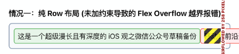
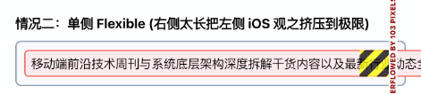
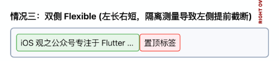
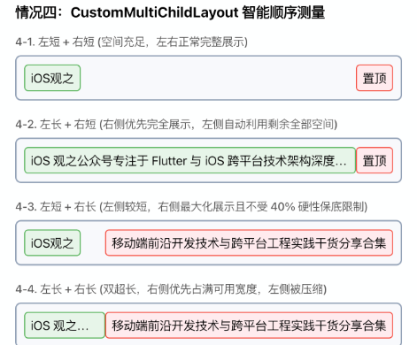

# Flutter 左右双文本布局问题探讨

> 实际工作中，我们经常会遇到这样的布局需求：在一行中并排展示两个文本 TextA 与 TextB。它们的长度均不固定，以 TextB 优先展示，TextA 可以被压缩截断。但要求：在空间足够时，两者必须完全展示。

---

## 一、 常见写法及其缺陷

在 Flutter 中实现 `Row(children: [TextA, TextB])` 时，为了应对动态长度，我们通常会尝试以下两种常规写法，但它们各自存在无法调和的缺陷。

### 尝试 1：不加任何约束的纯 Row

最直观的方法是直接将两个 Text 扔进 Row 中：

```dart
Row(
  children: [
    Text('这是一个超级漫长且有深度的 iOS 观之微信公众号草稿备份'),
    Text('移动端前沿开发技术与跨平台工程实践干货分享合集'),
  ],
)
```

* **问题**：如果左右文字总长度没有超过容器宽度还好，一旦双方都偏长，`Row` 就会直接报 **Flex 溢出错误**（也就是调试时那条著名的黄黑相间警告条），超出屏幕边界的文本会被直接裁剪而无法展示。



### 尝试 2：单侧使用 Flexible

既然要以右侧 TextB 优先展示，最容易想到的办法是只对左侧 TextA 进行 Flexible 限制：

```dart
Row(
  children: [
    Flexible(child: Text('iOS观之（超长占位）')), // 限制左侧 TextA
    Text('移动端前沿技术周刊与系统底层架构深度拆解干货内容以及最新行业动态全网首发专栏'), // 右侧 TextB 自由展开
  ],
)
```

* **问题**：
  如果右侧 TextB 极其漫长，由于它没有被任何约束框死，依然有可能把整行撑爆，引发溢出报错。即使没有溢出，右侧也会霸占整行空间，将左侧完全挤没。



### 尝试 3：双侧均使用 Flexible

为了防溢出，为两侧都包裹 `Flexible`：

```dart
Row(
  children: [
    Flexible(child: Text('iOS 观之公众号专注于 Flutter 与 iOS 跨平台技术架构深度分享和实战落地指南')),
    Flexible(child: Text('置顶标签')),
  ],
)
```

* **问题**：
  如果左侧文本很长，右侧文本很短（例如仅仅是一个极短的“置顶标签”），即便屏幕剩余空间**明明完全足够完整显示两者**，左侧的 TextA 依然会被**提前截断**并显示省略号，而右侧则会空出大片被闲置的灰色空白。
* **原因**：`Row` 布局时，各个子组件的约束测量是**相互隔离**的。`Flexible` 仅根据 flex 权重静态切分最大可用宽度（默认 1:1 分配 50% 额度），它在测量左侧时根本无法得知右侧实际只用了很小一部分，导致多余空间无法动态调配。



---

## 二、 破局方案：CustomMultiChildLayout 的“顺序测量”

上述常规写法的瓶颈在于，`Row` 无法在布局阶段让一个子组件的约束条件**依赖于另一个子组件测量后的实际尺寸**。

这正是 `CustomMultiChildLayout` 的用武之地。通过自定义 `MultiChildLayoutDelegate`，我们可以打破子组件之间的约束隔离，实现**以高优先级组件（TextB）为主导的感知测量**：

1. **先测量右侧优先展示的 TextB**。允许其最大可用宽度可以达到父容器总宽（100%）。在其最大限制下进行布局，并获取它的实际测量宽度 `W_b`。
2. **动态计算左侧 TextA 的最大限制**：`W_a_max = 总宽度 - W_b`。
3. **测量 TextA**。此时，如果左侧很短、右侧很长，由于我们先测右侧且允许其占用最大空间，右侧能够尽可能展示完全，且左侧在拿到剩余空间 `W_a_max` 后也能完整展示；如果空间不足，左侧 TextA 会自动被优雅压缩。
4. **定位组件**：TextA 靠左对齐，TextB 靠右对齐。同时，通过计算 Y 轴居中偏移，使它们在高度方向上完美垂直居中。



---

## 三、 完整示例代码

下面是完整的、符合 Flutter 空安全和最佳开发规范的实现代码：

```dart
import 'package:flutter/material.dart';

// 全局颜色常量，避免硬编码魔法值
class AppColors {
  static const Color textPrimary = Color(0xFF1F2937);   // 深灰色文字
  static const Color textSecondary = Color(0xFF4B5563); // 浅灰色文字
}

// 子组件唯一 ID
enum DoubleTextChildId {
  textA,
  textB,
}

/// 双文本智能顺序布局代理
class DoubleTextLayoutDelegate extends MultiChildLayoutDelegate {
  @override
  void performLayout(Size size) {
    // 1. 安全检查：确保两个子组件均已挂载
    if (!hasChild(DoubleTextChildId.textA) || !hasChild(DoubleTextChildId.textB)) {
      return;
    }

    final double maxTotalWidth = size.width;

    // 2. 先测量右侧优先展示的 TextB (最大宽度直接给到总宽)
    final Size bSize = layoutChild(
      DoubleTextChildId.textB,
      BoxConstraints(
        minWidth: 0,
        maxWidth: maxTotalWidth, // 右侧不受硬性比例强扣限制，能展示多少就占多少
        minHeight: 0,
        maxHeight: size.height,
      ),
    );

    // 3. 根据 TextB 测得的实际宽度，动态计算左侧 TextA 的最大可用宽度约束
    final double aMaxConstraint = maxTotalWidth - bSize.width;

    // 4. 测量左侧 TextA
    final Size aSize = layoutChild(
      DoubleTextChildId.textA,
      BoxConstraints(
        minWidth: 0,
        maxWidth: aMaxConstraint,
        minHeight: 0,
        maxHeight: size.height,
      ),
    );

    // 5. 计算 Y 轴居中偏移，以保证子组件在父容器高度内垂直居中
    final double aOffsetY = (size.height - aSize.height) / 2;
    final double bOffsetY = (size.height - bSize.height) / 2;

    // 6. 确定组件排版位置
    // TextA 紧贴最左边
    positionChild(DoubleTextChildId.textA, Offset(0, aOffsetY));

    // TextB 紧贴最右边
    positionChild(
      DoubleTextChildId.textB,
      Offset(maxTotalWidth - bSize.width, bOffsetY),
    );
  }

  @override
  bool shouldRelayout(covariant DoubleTextLayoutDelegate oldDelegate) => false;
}
```

### UI 层组装使用

在 Widget 树中，使用 `LayoutId` 绑定对应的唯一标识即可：

```dart
class DoubleTextRowWidget extends StatelessWidget {
  const DoubleTextRowWidget({
    super.key,
    required this.textA,
    required this.textB,
  });

  final String textA;
  final String textB;

  @override
  Widget build(BuildContext context) {
    return SizedBox(
      height: 48, // 设定合适的高度以观察居中效果
      child: CustomMultiChildLayout(
        delegate: DoubleTextLayoutDelegate(),
        children: [
          LayoutId(
            id: DoubleTextChildId.textA,
            child: Text(
              textA,
              maxLines: 1,
              overflow: TextOverflow.ellipsis,
              style: const TextStyle(
                fontSize: 16,
                fontWeight: FontWeight.w600,
                color: AppColors.textPrimary, // 显式声明颜色，防反色异常
              ),
            ),
          ),
          LayoutId(
            id: DoubleTextChildId.textB,
            child: Text(
              textB,
              maxLines: 1,
              overflow: TextOverflow.ellipsis,
              style: const TextStyle(
                fontSize: 14,
                color: AppColors.textSecondary, // 显式声明颜色，防反色异常
              ),
            ),
          ),
        ],
      ),
    );
  }
}
```

通过这一层 Delegate 的解耦，我们在不写复杂的自定义 RenderBox 的前提下，优雅地用极少代码解决了 Flutter 中动态双文本的布局冲突。

---

*本文首发于微信公众号「iOS观之」（微信号：run88184），欢迎关注。*
