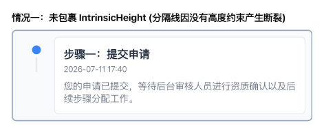
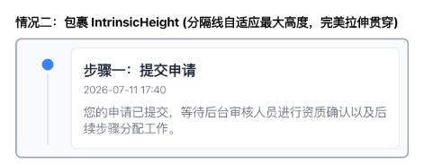

# Flutter 时间轴线画不出来？快用 IntrinsicHeight 测量魔法！

> 导语：在实现内容高度不确定的时间轴需求时，如何让左侧的垂直轴线与右侧内容卡片的高度保持一致？本文将为你揭秘 Flutter 中高度拉伸的终极解法——`IntrinsicHeight`。

---

## 前言

在移动端应用中，时间轴（Timeline）是一种极其常见的 UI 表现形式，广泛应用于物流追踪、审批流步骤、成长足迹等业务场景。

虽然看起来简单，但在 Flutter 中实现它时，大部分开发者都会遇到一个头疼的排版难题：**右侧的卡片内容是动态的，字数高矮完全不确定；而左侧的垂直轴线则需要与内容高度保持一致，并且自动贴合对齐**。

因为不知道右侧内容卡片到底有多高，左侧的垂直线应该画多长？如果你也曾为此抓狂，那么今天介绍的 `IntrinsicHeight` 组件，就是解决这一痛点的黄金钥匙。

---

## 一、 痛点再现：高度无法同步的垂直线

按照常规思路，我们通常会在一个 `Row` 里面，把布局拆分为“左侧（圆点 + 垂直线）”和“右侧（内容卡片）”两部分：

```dart
Row(
  crossAxisAlignment: CrossAxisAlignment.start,
  children: [
    // 左侧：圆点 + 垂直线
    Column(
      children: [
        Icon(Icons.circle),
        Expanded(
          child: VerticalDivider(thickness: 2, color: Colors.grey),
        ),
      ],
    ),
    // 右侧：内容卡片
    Expanded(
      child: Container(
        padding: const EdgeInsets.all(16),
        child: Text("这是一段高度不确定的超长文本内容..."),
      ),
    ),
  ],
)
```

然而，运行这段代码，你会遇到以下几种布局结果：

### 1. 垂直线直接消失（高度为 0）
由于 `Row` 在垂直方向上对子组件的默认约束是松散的（没有强行限制高度），`VerticalDivider` 或未指定具体高度的 `Container` 根本无法计算出自己应该伸展到多高，导致高度直接塌陷为 0，线完全不显示。

### 2. 发生严重的布局越界报错（Flex Overflow）
如果我们为了让垂直线拉伸，而在 `Row` 的外层或 `Row` 的 `crossAxisAlignment` 中强行设置 `CrossAxisAlignment.stretch`，但外层又没有给 `Row` 设置明确的固定高度约束，Flutter 引擎便不知道该按什么高度去拉伸，从而直接抛出黄黑相间的 **Layout Overflow** 错误：
> *RenderFlex children have non-zero flex but incoming height constraints are unbounded.*

### 3. 写死高度导致布局脆弱
为了妥协，很多开发者会尝试给线或 `Row` 设定一个固定高度（比如 `height: 100`）。但这种硬编码极其脆弱：一旦右侧内容文字过多产生换行，文字就会直接溢出卡片；如果文字很少，卡片下面又会留出大片闲置的空白（如下图所示）。



---

## 二、 认识 IntrinsicHeight 的高度拉伸

如何让“左侧轴线的高度”刚好能够自动同步并贴合“右侧内容卡片”的实际测量高度？

Flutter 为我们提供了一个非常神奇的布局组件：**`IntrinsicHeight`**。

### 什么是 IntrinsicHeight？
官方文档对它的描述非常简单：
> *A widget that sizes its child to the child's intrinsic height.*
> 一个将其子组件的大小调整为子组件“固有高度”的组件。

当我们在 `Row` 外层包裹 `IntrinsicHeight` 后，它会执行以下布局动作：
1. **收集固有高度**：遍历 `Row` 的所有子组件，并计算出它们在不带任何约束限制时的固有高度（对于右侧的内容卡片，它的固有高度就是文字内容完全展开后所需的实际高度）。
2. **取最大值作为统一高度**：找出子组件中固有高度的最大值（即右侧内容卡片的高），并将这个最大高度作为整个 `Row` 的最终测量高度。
3. **强制拉伸其他组件**：在 `Row` 的 `crossAxisAlignment` 设为 `CrossAxisAlignment.stretch` 时，将这个最大固有高度作为强约束传递给其他子组件，从而让左侧的 `VerticalDivider` 能够在无须硬编码高度的情况下，自动拉伸并与右侧等高对齐。



---

## 三、 深入 IntrinsicHeight 的工作原理与代价

虽然 `IntrinsicHeight` 很好地解决了我们“高度同步”的排版难题，但我们在使用它之前，必须看清它在底层付出的性能账本。

### 1. 它是如何测量的？
在 Flutter 中，常规的 Layout 流程遵循“**约束自上而下传递，尺寸自下而上反馈**”（Constraints go down. Sizes go up.）的黄金原则，且每个组件通常只需要测量（Measure）一次，因此性能非常高。

然而，`Intrinsic` 类的组件打破了这一高效流程。为了知道“最大固有高度”是多少，`IntrinsicHeight` 必须在正式布局前对其子组件执行一次 **推测性布局测量（Speculative Layout）**。

具体而言：
* 它会先询问子组件的 `minIntrinsicHeight` 和 `maxIntrinsicHeight`。
* 在多层嵌套的复杂布局中，如果层层包裹 `IntrinsicHeight`，这种推测性测量会在子组件树中进行递归，甚至会导致子组件被重复测量多次。
* 在极端情况下，这种双次测量开销会把常规的 `O(N)` 布局复杂度放大到 **`O(N²)`**。

### 2. 避坑指南与最佳实践
基于上述性能特征，我们在项目中使用 `IntrinsicHeight` 时，必须严格遵循以下原则：
* **禁止在超长列表的 Item 中无脑滥用**：如果你的时间轴有成千上万个节点，且包裹在 `ListView.builder` 中，若每个 Item 都使用 `IntrinsicHeight`，在快速滑动时会频繁触发大量重绘和双次测量，导致帧率严重下降甚至卡顿。
* **优先考虑局部包裹**：只在需要高度同步的最细粒度组件上包裹它，绝对不要用来做页面的根布局容器。
* **长列表替代方案**：如果必须在长列表中展示时间轴，可以使用类似 `CustomPaint` 在每个 Item 的 Canvas 上绘制特定比例的线段，或针对最后一个节点做特殊绘制，避开运行时的布局测量。

---

## 四、 实战：核心时间轴 Item 示例

接下来，我们编写一个符合规范、高颜值且足够精炼的 Flutter 时间轴 Item 示例。

在编写示例代码时，我们依然严格遵循以下**代码规范**：
1. **无魔法值**：所有颜色统一定义在 `AppColors` 常量中。
2. **显式文字颜色**：所有 `TextStyle` 均显式指定 `color`，防止深色模式下因为颜色反转导致的显示异常。

```dart
import 'package:flutter/material.dart';

// 样式与颜色常量定义
class AppColors {
  static const Color primary = Color(0xFF3B82F6);      // 品牌蓝
  static const Color textPrimary = Color(0xFF1F2937);   // 主文本色
  static const Color textSecondary = Color(0xFF6B7280); // 次文本色
  static const Color border = Color(0xFFE5E7EB);        // 边框线色
  static const Color background = Color(0xFFF9FAFB);    // 卡片背景色
}

class TimelineItemWidget extends StatelessWidget {
  const TimelineItemWidget({
    super.key,
    required this.title,
    required this.time,
    required this.description,
    this.isLast = false,
  });

  final String title;
  final String time;
  final String description;
  final bool isLast;

  @override
  Widget build(BuildContext context) {
    // 关键点：外层包裹 IntrinsicHeight，使 Row 的高度由其“最长子组件”（即右侧文本卡片）的固有高度决定
    return IntrinsicHeight(
      child: Row(
        crossAxisAlignment: CrossAxisAlignment.stretch, // 必须：使左侧分隔线自动拉伸填充父容器高度
        children: [
          // 左侧轴线区
          SizedBox(
            width: 48,
            child: Column(
              children: [
                const SizedBox(height: 16), // 让圆点与右侧卡片第一行文本对齐
                
                // 1. 时间轴圆点
                Container(
                  width: 14,
                  height: 14,
                  decoration: const BoxDecoration(
                    color: AppColors.primary,
                    shape: BoxShape.circle,
                  ),
                ),
                
                // 2. 垂直线（非最后一个节点时展示）
                if (!isLast)
                  Expanded(
                    child: Container(
                      width: 2.0,
                      color: AppColors.border,
                    ),
                  ),
              ],
            ),
          ),
          
          // 右侧内容卡片（高度动态变化）
          Expanded(
            child: Padding(
              padding: const EdgeInsets.only(bottom: 24.0),
              child: Container(
                padding: const EdgeInsets.all(16.0),
                decoration: BoxDecoration(
                  color: AppColors.background,
                  borderRadius: BorderRadius.circular(8.0),
                  border: Border.all(color: AppColors.border, width: 1.0),
                ),
                child: Column(
                  crossAxisAlignment: CrossAxisAlignment.start,
                  children: [
                    Text(
                      title,
                      style: const TextStyle(
                        fontSize: 16.0,
                        fontWeight: FontWeight.bold,
                        color: AppColors.textPrimary, // 规范：显式设置颜色
                      ),
                    ),
                    const SizedBox(height: 4.0),
                    Text(
                      time,
                      style: const TextStyle(
                        fontSize: 12.0,
                        color: AppColors.textSecondary, // 规范：显式设置颜色
                      ),
                    ),
                    const SizedBox(height: 8.0),
                    Text(
                      description,
                      style: const TextStyle(
                        fontSize: 14.0,
                        height: 1.4,
                        color: AppColors.textSecondary, // 规范：显式设置颜色
                      ),
                    ),
                  ],
                ),
              ),
            ),
          ),
        ],
      ),
    );
  }
}
```

---

## 写在最后

`IntrinsicHeight` 就像是 Flutter 排版工具箱里的“定位特效药”。它在解决类似时间轴线高度同步、行内子组件等高对齐等痛点上，提供了无可替代的易用性。

然而，优秀的 Flutter 工程师必须认识到便利背后的性能开销。在处理海量数据的列表时，我们需要克制对它的偏爱，主动通过预估高度或自定义绘制进行调优。**只有在正确的地方使用对的工具，才能写出既优雅又丝滑流畅的 Flutter 应用**。

---

*本文首发于微信公众号「iOS观之」（微信号：run88184），欢迎关注。*
